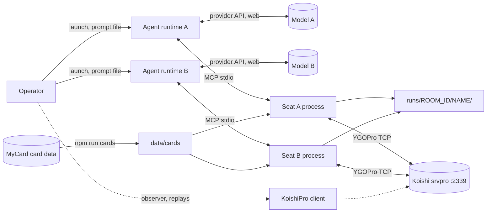

# Architecture

Status: ACCEPTED (2026-10-07)

Source concept: [context/concept-zero.md](context/concept-zero.md)

Contracts: [contracts.md](contracts.md)

Last updated: 2026-10-07

Implementation status: the seat is implemented (roadmap P1.1–P1.10 and P2.1) with offline diagnostics, live smoke runs on 2339 and real runtime handshakes; the agent matches (P1.11, P2.2) are the remaining proof. See [status](status.md).

## Executive Decision

`IMPLEMENTED`: one Node process per model, called the **seat**, is both a stdio MCP server spawned by that model's agent runtime and a YGOPro network client of `koishi.momobako.com:2339`. One event loop runs four layers with one-way dependencies:

- wire: `protocol/`, `net/`;
- seat state machine: `seat/`;
- pure translation: `game/`, `deck/`, `cards/`;
- MCP surface: `mcp/`.

The server stays the only rules authority. The seat mirrors what the server reports, turns each server question into a numbered prompt, and turns the model's numbers back into response bytes with `ygopro-msg-encode`. There is no orchestrator, database, queue, HTTP service or helper process. Two seats meet only in the server room. The run folder holds the server's replays plus one result line per duel.

Excluded: rule checks, validators, redaction, tool limits, output caps, version pinning, reconnect, narration, rankings.

Implementation is complete when two real agents, each in its own runtime, build their own decks and finish a Bo3 on 2339 with siding and chat, and the server's replays are saved (Q-01 to Q-05). A model-free smoke run checks the plumbing first. It is a diagnostic, not a qualification stage.

## Architecture Drivers

IDs come from the concept. `D-` items are derived from research done for this document.

- `G-01` Goal: the model builds its own deck (search, card text, edit, YDK/`ydke://` import); the server's deck check is the only check.
  Evidence: concept G-01, E-04, E-10.
  Architecture impact: `cards/catalog.js` (search, text), `deck/deck.js` (edit, import, `UPDATE_DECK` payload), deck prompt and `DECKERROR` translation in `seat/controller.js`.
  Verification gate: `deck.test.js` round trips; Q-03 rejection tests; the agents' own decks in Q-01.

- `G-02` Goal: a full Bo3 — RPS, first/second, every in-duel prompt, siding, surrender.
  Evidence: concept G-02, E-06.
  Architecture impact: controller phases `deck → lobby → rps → first → duel → side → … → ended`; prompt builders for all 20 response-bearing messages in `ygopro-msg-encode` plus RPS, first/second, deck and side.
  Verification gate: Q-01 agent matches; `prompts.test.js` covers every prompt type.

- `G-03` Goal: chat both ways.
  Evidence: concept G-03; srvpro treats lines starting with `/` as commands.
  Architecture impact: `chat` tool; incoming `STOC_CHAT` tagged as opponent, server or observer; a new opponent line wakes a pending `wait`.
  Verification gate: the smoke run sends one line each way; `controller.test.js` tags captured server lines; the agents chat in Q-01.

- `G-04` Goal: each match leaves the server's replays plus one result line per duel.
  Evidence: concept G-04, E-07; srvpro sends match replays right after `DUEL_END` ([source](https://github.com/mycard/srvpro/blob/c16bbccddbd5f3304e6e1d93118db45e8868003f/ygopro-server.coffee#L3111-L3126)).
  Architecture impact: `seat/record.js` writes raw `STOC_REPLAY` payload bytes as `.yrp`, `results.jsonl` and the submitted `.ydk`. The controller reports the match over only once the replays are in (Runtime View, End), so the run folder is complete before the model can end its session.
  Verification gate: Q-01 checks the files exist; the operator opens one replay in KoishiPro.

- `C-01` Constraint: the server, room `M,TM0,NF#<id>`, the server version and the card data are all live; nothing is pinned.
  Architecture impact: room comes from config; the client version handshake retries once on `VERERROR` (existing behavior); card data is refreshed by `npm run cards`; no manifest or hash code. Bo3 is the default room. The seat follows the server's match end and assumes no number of duels, so a Bo1 room (`TM0,NF#<id>`) needs no seat change.

- `C-02` Constraint: the seat is an MCP server added to an unmodified runtime.
  Architecture impact: stdio transport, a static tool list, launch recipes in Operations; no tool gating.

- `C-03` Constraint: server output passes through unchanged.
  Architecture impact: no redaction module. `game/labels.js` fills in names the server zeroed for opponent-controlled candidates, from the seat's own board (E-05). That is labeling, not filtering.

- `Q-01` Two agents build their decks and finish a Bo3 on 2339 with siding and chat → `DUEL_END`; one replay per duel and the result lines are saved.
  Mechanism: the whole seat, launched by the Operations recipes. `bin/smoke.js` checks the lobby, side and end path first, without a model.

- `Q-02` A prompt held for 15 minutes, then answered → still connected, answer accepted.
  Mechanism: no game clock (`TM0`); the controller answers `STOC_TIME_LIMIT` with `CTOS_TIME_CONFIRM` as soon as the packet arrives. Packet handling never awaits the model.

- `Q-03` Illegal deck, side or answer → the model reads the server's reason and recovers.
  Mechanism: `DECKERROR` returns to the deck prompt, `SIDEERROR` to the side prompt, and `MSG_RETRY` re-issues the last prompt, each with a `rejected` text.

- `Q-04` A face-up opponent card in a selection prompt is shown by name.
  Mechanism: `labels.js` resolves zeroed codes through `board.js` by (controller, location, sequence).

- `Q-05` The opponent thinks for 10 minutes → `wait` returns "still waiting" before the runtime's tool timeout, and no events are lost.
  Mechanism: `wait` blocks at most `YGO_WAIT_MS`. Events stay in an append-only log with a delivery cursor.

- `U-1..U-4` Unacceptable outcomes from the concept.
  - U-1, missing capability: an unknown message becomes a visible event plus an error log line, never a silent drop.
  - U-2, the seat choosing for the model: auto-answers follow AD-07 only.
  - U-3, no record: files are written as their bytes arrive.
  - U-4, a slow model disconnected: covered by Q-02.

- `D-01` Runtime limits, checked on 2026-10-07. Every output limit below is configurable; none is fixed.
  - Claude Code (current docs; local install 2.1.280) ([docs](https://code.claude.com/docs/en/mcp)):
    - Per-call wall clock: about 28 h by default.
    - A stdio call with no response or progress for 30 minutes is aborted (since v2.1.203).
    - In interactive sessions, a call still running after 2 minutes moves to the background (v2.1.212+); in `-p` mode it does not.
    - A text result over 25k tokens (`MAX_MCP_OUTPUT_TOKENS`) or 50k characters is saved to a file and replaced by its path. A tool that declares `_meta["anthropic/maxResultSizeChars"]` keeps results up to that size inline, at most 500k characters.
  - Codex CLI ([constants](https://github.com/openai/codex/blob/rust-v0.160.1/codex-rs/codex-mcp/src/rmcp_client.rs#L105-L106), [approval](https://github.com/openai/codex/blob/rust-v0.160.1/codex-rs/codex-mcp/src/mcp/mod.rs#L89-L111), [config](https://learn.chatgpt.com/docs/config-file/config-reference)):
    - The 0.160.1 source defaults to 30 s startup and 300 s per call, while the docs say 10 s and 60 s. The local install is 0.159.2, so the recipe sets `tool_timeout_sec` explicitly. The timeout is wall-clock; progress does not extend it.
    - Tool output is truncated to `tool_output_token_limit`, or to a per-tool `output_token_limit`.
    - `codex exec` cannot prompt, so a call that needs approval is denied. The server setting `default_tools_approval_mode = "approve"` avoids that. The source also auto-approves under approval policy `never` with sandboxing off or full disk write access.
  - Gemini CLI (0.63.0 source; local install 0.46.0) ([config](https://geminicli.com/docs/reference/configuration/)):
    - 600 s default per-call timeout.
    - Output over `tools.truncateToolOutputThreshold` (default 40,000 characters) is truncated, and the full text goes to a temporary file.
    - Tools are denied in headless mode unless the server is trusted.
  - The latest MCP revision (2026-07-28) is stateless, but Codex and Gemini still use the 2025-06-18 `initialize` handshake.
  - Architecture impact:
    - `YGO_WAIT_MS` defaults to 240 s. Each recipe sets the runtime's per-call timeout above it explicitly instead of relying on defaults.
    - The seat sets no output limit of its own (AD-13). The recipes raise each runtime's limit, and every tool declares `anthropic/maxResultSizeChars`.
    - The Claude Code recipe uses `-p`, where calls never move to the background.
    - The seat must accept the 2025-06-18 handshake. Checked in P1.10: Claude Code 2.1.280 and Codex 0.159.2 both connected and held one 240 s call.

- `D-02` Library defects found in `ygopro-msg-encode` 1.3.0.
  - `SELECT_SUM.prepareResponse` writes the chosen indices right after the count byte, but ocgcore reads them only after the must-select slots ([library](https://github.com/purerosefallen/ygopro-msg-encode/blob/9a53630de5a31f29229866c19697684b9baa4267/src/protos/msg/proto/select-sum.ts#L73-L115), [ocgcore](https://github.com/Fluorohydride/ygopro-core/blob/e5ce3178a7d78d3d31de0ef40993cb83b34772ce/playerop.cpp#L689-L703), stock client [puts must-select cards first](https://github.com/Fluorohydride/ygopro/blob/bfa360f631010f9eb9d74d1054e2732388de7860/gframe/duelclient.cpp#L2074-L2090) and [writes every selected index in order](https://github.com/Fluorohydride/ygopro/blob/bfa360f631010f9eb9d74d1054e2732388de7860/gframe/event_handler.cpp#L2432-L2441)).
  - Reproduced on 2026-10-07 with real library objects: one must-select card plus choice index 1 encodes as `[2,1]`, where the stock client sends `[2,0,1]`.
  - The `SELECT_COUNTER` semantic matcher compares each card to itself.
  - `SORT_CARD.prepareResponse` writes the cards in their new order, but ocgcore reads byte *i* as the new position of card *i* ([ocgcore](https://github.com/Fluorohydride/ygopro-core/blob/e5ce3178a7d78d3d31de0ef40993cb83b34772ce/processor.cpp#L677-L682)), so any cyclic reorder of three or more cards comes out inverted.
  - Architecture impact: always encode by `IndexResponse`; `prompts/selections.js` pads `SELECT_SUM` and writes `SORT_CARD` positions itself. The shuffle decoder also interleaves the old-location and new-location arrays; `protocol/packets.js` repairs that layout before the board reads it. All four are prepared for upstream in [docs/upstream](upstream/ygopro-msg-encode.md), with failing tests in `spec/upstream-msg-encode.test.js`.

- `D-03` ocgcore emits `MSG_SELECT_CHAIN` with zero options at every priority pass ([source](https://github.com/Fluorohydride/ygopro-core/blob/e5ce3178a7d78d3d31de0ef40993cb83b34772ce/playerop.cpp#L333-L358)), and the stock client passes them automatically (concept E-13).
  Architecture impact: auto-pass in `prompts/index.js`; without it the model would get dozens of empty prompts per turn.

- `D-04` A client learns whether it is the duel's player 0 or 1 from `MSG_START`, and that can change every duel ([source](https://github.com/Fluorohydride/ygopro/blob/bfa360f631010f9eb9d74d1054e2732388de7860/gframe/single_duel.cpp#L462-L476)).
  Architecture impact: `board.js` maps absolute player ids to me/opponent per duel.

- `D-05` Three selection prompts judge an answer by numbers the message carries, not by how many cards are chosen.
  - `SELECT_TRIBUTE`: a legal answer has at most `max` cards whose tribute values (`releaseParam`) add up to at least `min`. With one card worth two tributes, one worth one, and `min` = `max` = 2, the first card alone and both cards are both legal ([ocgcore](https://github.com/Fluorohydride/ygopro-core/blob/e5ce3178a7d78d3d31de0ef40993cb83b34772ce/playerop.cpp#L512-L574)).
  - `SELECT_SUM`: each card counts as one of one or two values packed in `opParam` ([split](https://github.com/Fluorohydride/ygopro-core/blob/e5ce3178a7d78d3d31de0ef40993cb83b34772ce/field.cpp#L2890-L2897)). Mode 0 needs an exact total from `min`..`max` chosen cards; mode 1 needs the target reached with no spare card ([ocgcore](https://github.com/Fluorohydride/ygopro-core/blob/e5ce3178a7d78d3d31de0ef40993cb83b34772ce/playerop.cpp#L647-L750)).
  - `SELECT_COUNTER`: one count per card, each at most that card's counters, adding up to the requested total ([ocgcore](https://github.com/Fluorohydride/ygopro-core/blob/e5ce3178a7d78d3d31de0ef40993cb83b34772ce/playerop.cpp#L575-L636)).
  - Architecture impact: options carry `tributes`, `values` or `counters` (contracts Answers), and AD-07 answers a tribute automatically only when every card counts as one.

## Evidence and Source Reconciliation

- The concept ([context/concept-zero.md](context/concept-zero.md)) is authoritative. On 2026-10-07, after review, the user accepted it, this architecture and AD-01 as the source of truth. The earlier concept (`300a985`), which kept the WindBot relay open, is superseded.
- `alignment.md` is historical; the concept's Supersedes table lists what it no longer decides.
- Repository: the transport core and probe are implemented ([core proof](specs/core.md)). The rest of the source tree below is implemented on top of it, test first ([remaining work](specs/remaining.md)), and `npm test` runs it offline.
- Live evidence, 2026-10-07 ([status](status.md)):
  - `npm run smoke` passed twice on 2339: lobby, rock-paper-scissors, first player, two surrendered duels, siding, `DUEL_END`, two replays per run folder, and chat both ways.
  - A deck with the super-pre card 101306093 was accepted.
  - srvpro announces a 3-minute Side Deck limit and a cloud replay id per duel.
  - Both runtime handshakes passed.
- `docs/status.md` and `docs/checkouts.md` now describe this Node path and link to the governing docs. The removed research document has no active navigation links.
- `npm test` remains scoped to `test/`; the `submodules` command remains available. The pre-existing staged `alignment.md` → `docs/alignment.md` move is preserved. No upstream checkout was changed.
- Node is the existing project stack, and the accepted concept explicitly chooses the npm codec. The core preserves JavaScript ESM and Node ≥22.
- External facts verified on 2026-10-07:
  - `@modelcontextprotocol/server` 2.3.1: Apache-2.0, depends only on `zod` ^4.2 and `@modelcontextprotocol/core`; 2.0.0 shipped 2026-07-27; `registerTool` accepts `_meta`.
  - SDK v1 1.32.0 pulls in express, hono, cors and jose even for stdio.
  - `pino` 10.4.0 (MIT), `ygopro-cdb-encode` 1.1.1 (MIT, sql.js 1.14). Several CDB instances can be open side by side. Opening an 8 MB CDB takes about 21 ms, a lookup by code about 2 ms, a full scan about 181 ms.
  - The installed set, all exact pins and all runtime dependencies: `ygopro-msg-encode` 1.3.0, `ygopro-deck-encode` 1.0.16, `ygopro-cdb-encode` 1.1.1, `sql.js` 1.14.2 (the catalog initializes it), `@modelcontextprotocol/server` 2.3.1, `@modelcontextprotocol/client` 2.3.1 (the smoke command is an MCP client), `zod` 4.6.5, `pino` 10.4.0 and `fflate` 0.8.3 (MIT, no dependencies, reads operator `.ypk` packs). `npm audit` reports 0 vulnerabilities.
  - Downloads: through this machine's HTTP proxy, Node's `fetch` needs `NODE_USE_ENV_PROXY=1`; an 8 MB CDB then took about 32 s, so each download attempt allows 5 minutes.
  - First-edition pack: the operator-supplied `first-edition-effects.ypk` holds a 29-card CDB (`2012.cdb`) whose text gives each card's original effect, then its 2016 errata, plus Lua scripts the seat never runs.
  - Adopt-before-build check: none of the reviewed candidates is a reusable headless JS/TS YGOPro client.
    - The search covered the npm reverse dependencies of `ygopro-msg-encode`, GitHub code search and 11 candidate package names.
    - It found spectator scripts, a 2020 replay fetcher and GUI apps such as Neos (GPL web client).
    - WindBot (C#) is the only full headless client found, and stays a reference.

    A bounded search does not prove that no such client exists. It is enough to choose building the seat on the codec.
  - Library maturity: `ygopro-msg-encode` has had 42 versions since 2026-02. Neos adopted it and reverted the same day (2026-04-30, reason unknown). Its `MSG_RANDOM_SELECTED` and `MSG_BECOME_TARGET` fields are typed differently from the C++ client, but with the same wire width.
  - Card data: the four `mycard/ygopro-database` locale files return 200 from GitHub raw; both CDBs hold 15,019 cards; there is no license file. MyCard super-pre serves `test-release.cdb` (96 cards), `test-update.cdb` (377 rows) and `test-strings.conf` individually under `cdn02.moecube.com:444/ygopro-super-pre/data/`, byte-identical to the 18 MB `.ypk`, which is updated almost daily. The text is zh-CN only. `ElderLich/TransSuperpre` publishes English versions of the same IDs daily, with no license.
  - Smoke test on that set: the live en-US `cards.cdb` (8 MB) opens through `ygopro-cdb-encode`; code lookup and filter search work, with filter keys being CDB column names (`atk`, `def`, `race`, `attribute`). A `ydke://` round trip through `ygopro-deck-encode` is exact. The en-US `strings.conf` carries 535 `!system` strings plus the `!victory` texts.
- Source facts used here: E-04 to E-13 from the concept, plus D-02 to D-05 above. One more: ocgcore re-checks declared card names (`is_declarable`, [source](https://github.com/Fluorohydride/ygopro-core/blob/e5ce3178a7d78d3d31de0ef40993cb83b34772ce/playerop.cpp#L1000-L1020)), so the seat sends the model's declaration as given.

## System Context and Boundaries



The system is the seat process, its source, the card-refresh command, the smoke command and the run folder. Agent runtimes, model providers, the Koishi server, MyCard's card data and KoishiPro are external and used as they are.

Trust boundaries:

- **Server → seat.** Untrusted bytes. `framing.js` rejects a zero-length frame; the protocol itself uses a uint16 packet length (at most 65,535 bytes after the length field). A message that fails to parse becomes an `unreadable` event plus a log line; the seat keeps running.
- **Opponent chat → model.** Untrusted text, delivered as is and tagged with its sender (concept: no filter).
- **Model → seat.** Tool arguments are validated by zod schemas before any handler runs.
- **Card sources → disk.** HTTPS downloads go to a temporary file first, then replace the target with a rename.

The seat holds no secrets. Provider credentials live in the runtimes.

## Selected Architecture

The shape is a layered single process with a pure core. All game understanding (board, events, prompts, labels, deck edits, card lookups) consists of pure functions over `ygopro-msg-encode` objects and catalog reads, which makes it testable from captured sessions without a network. Side effects live in four places: `net/connection.js` (socket), `seat/record.js` (run folder), `cards/sources.js` (downloads) and `mcp/server.js` (stdio). `seat/controller.js` is the only stateful coordinator. This is the smallest shape that keeps each piece testable alone. Merging the controller into the MCP layer or the board into the controller would create a god module that mixes transport, state and rendering.

### Runtime View

- **Start.**
  1. The agent runtime spawns `node src/bin/seat.js` with `YGO_*` environment variables.
  2. Startup parses config. It opens the catalog and fails fast with a message naming `npm run cards` if card data is missing.
  3. It loads `YGO_DECK` into the working deck if set.
  4. It creates the controller in phase `deck`, then connects MCP over stdio.

  No socket is open yet. A model can spend as long as it likes building a deck without holding a lobby slot.
- **Join.** The first deck `submit` runs these steps:
  1. Open TCP.
  2. Send `PLAYER_INFO` and `JOIN_GAME`, retrying once with the server's version on `VERERROR`.
  3. Send `UPDATE_DECK` and `HS_READY`.

  On `DECKERROR`, the seat returns to the deck prompt and stays connected. Once both players are ready, the host sends `HS_START`.
- **Steady state.** For every incoming packet, the socket data goes through `framer`, `parse` and `controller.onMessage`, which runs synchronously. That handler may then:
  - send an auto-reply (keepalive, empty chain, single-answer prompts per AD-07);
  - append events;
  - set the pending prompt and wake the waiter.

  Tool calls are separate async entry points. `wait` resolves when a prompt is pending, the phase changes to `ended` or `disconnected`, or an opponent chat line arrives, or else after `YGO_WAIT_MS`. `answer` sends the response, then behaves like `wait`.
- **Between duels.** `STOC_CHANGE_SIDE` starts a `side` prompt. The submit sends `UPDATE_DECK`, and `SIDEERROR` returns to the side prompt. `STOC_SELECT_TP` goes to the loser of the previous duel.
- **End.** `STOC_DUEL_END` ends the match, whether after two wins or earlier on a match kill (concept E-06); the seat counts no duels itself.
  - srvpro sends the replays it held right after `DUEL_END` ([source](https://github.com/mycard/srvpro/blob/c16bbccddbd5f3304e6e1d93118db45e8868003f/ygopro-server.coffee#L3111-L3126)), and each one is written as it arrives.
  - The phase becomes `ended` once the seat holds one replay per duel played, the server closes the connection, or 15 s pass, whichever comes first. The seat then leaves the room.
  - So the run folder is complete before any tool reports the match over, and an agent that stops at "match over" cannot cut off its replays. The wait is normally milliseconds.
- **Shutdown.** The process lives until the runtime closes stdin. It then sends `LEAVE_GAME` if still connected, flushes the log and exits 0.
- **Failures.** A socket error or unexpected close puts the seat in phase `disconnected` with a reason. Every tool reports it. There is no auto-reconnect (see Later).
- **Other commands.**
  - `npm run cards` refreshes card data and exits.
  - `npm run probe` joins a room, prints the lobby JSON and leaves.
  - `npm run smoke` spawns two seats with no model. They join, chat one line each, surrender every duel, keep their decks at side, and the command checks that each run folder holds a match line and one replay per duel played.

### Component View

- **Wire** (`protocol/framing.js`, `protocol/packets.js`). It frames bytes into packets, builds every CTOS packet the seat sends, and parses STOC packets into `ygopro-msg-encode` objects, keeping the raw payload. It owns no state beyond the framer buffer. A failure surfaces as a thrown parse error, which the connection reports.
- **Connection** (`net/connection.js`). It owns the socket: connect timeout, ordered writes, and close reasons (`server-closed`, `error`, `local`). Its interface is `openConnection({host, port, timeoutMs, onMessage, onClose, onError}) → Promise<{send, close, closed}>`; callbacks are installed before connecting. Parsed-message failures go to `onError` and later packets remain readable. It knows nothing about phases or prompts.
- **Seat controller** (`seat/controller.js`). It is the only stateful module. It owns:
  - phase, connection handle, duel index, my duel player, board, pending prompt, event log, chat log;
  - working and submitted decks, match score;
  - the single pending waiter.

  It implements every behavior in the Runtime View and exposes the seat API that `mcp/tools.js` calls: `snapshot`, `wait`, `answer`, `chat`, `surrender`, `setDeck`, `markDelivered`, `close`. It translates server errors into prompts or text. It does not render text, import MCP or touch the filesystem directly; `record` and `connection` are injected.
- **View mapping** (`seat/view.js`). This pure function turns controller, board and prompt state into the SeatView DTO. It owns:
  - the delivery cursors and board elision;
  - the `next` sentence;
  - removing internal fields (contracts.md Mapping).

  It is the only place an internal entity becomes a boundary shape.
- **Recorder** (`seat/record.js`). It owns `runs/<room-id>/<player-name>/`, path sanitizing (the part of the room after `#`, filesystem-safe), append-only `results.jsonl`, `duel-<n>.ydk` at each submit, `replay-<k>.yrp` as raw bytes, and `session.bin` when `YGO_CAPTURE=1`. A write failure is logged and reported as an event; the match continues.
- **Board mirror** (`game/board.js`). It is a pure reducer, `applyBoard(board, msg, {catalog}) → board`. It builds both sides from this player's view:
  - every zone with card queries (code, position, ATK/DEF, level/rank/link, counters, overlays, equip/target, status);
  - LP, turn, phase, turn player and the chain stack.

  It takes stats from `MSG_UPDATE_DATA`/`MSG_UPDATE_CARD` and card presence from deltas (`MOVE`, `DRAW`, `SET`, `POS_CHANGE`, `SWAP`, `SHUFFLE_*`, `CHAINING`/`CHAIN_*`). WindBot's `GameBehavior` handlers are the reference for each delta. It must never infer rules.
- **Events** (`game/events.js`). It is pure, mapping game messages to `{kind, text, turn, phase}` records. It tracks the last `HINT_SELECTMSG` so the next prompt can say what is being selected. Unknown message types become `unreadable` events.
- **Prompts** (`game/prompts/*`). These are pure functions:
  - `build(msg, ctx) → Prompt | {auto: response}`;
  - `encode(prompt, answer) → Uint8Array`.

  Options are numbered from 1 in message order and encoded through `IndexResponse`; `prompts/options.js` holds the shared labels and answer checks. Tribute, sum and counter options carry the numbers the server judges them by (D-05). Auto-answers follow AD-07, and each one is recorded as an event.
- **Labels** (`game/labels.js`). These are pure naming helpers: zones (`your M3`, `opponent S2`, `EMZ left`), positions, phases, attributes, races, and the card label from board plus catalog, including the zeroed-code fallback (Q-04).
- **Catalog** (`cards/catalog.js`, `cards/strings-conf.js`). It is read-only.
  - At start it reads every available CDB through sql.js into in-memory maps, lowest priority first, so later rows replace earlier ones. The resulting priority is en-US, then super-pre English, then super-pre (MyCard, zh-CN), then zh-CN.
  - Then the CDBs inside any `first-edition/*.ypk` replace the text and non-empty effect strings of their cards. Names and stats stay.
  - Every card records its source, so card info can say where its text came from.
  - It offers:
  - `card(code)`, `findByName(name)`, `search(filters)`;
  - `desc(code)`: ≤ `0x7ff` gives a system string, otherwise `code >> 4` gives the card and the low 4 bits pick the string;
  - `systemString`, `victoryReason`, `counterName`, `setName`.

  A missing code returns `null`; callers render `#<code> (no local text)`.
- **Deck** (`deck/deck.js`). It is a pure working-deck model: add, remove or move cards across main/extra/side; import/export YDK, `ydke://` and KoishiPro deck codes through `ygopro-deck-encode`; build the `UPDATE_DECK` payload. It places cards by catalog type (Fusion/Synchro/Xyz/Link go to extra) unless the caller names a section. It performs no legality checks.
- **MCP surface** (`mcp/server.js`, `mcp/tools.js`, `mcp/render.js`).
  - `server.js` builds the `McpServer` and the stdio transport.
  - `tools.js` declares the tool list and maps arguments to the seat API and catalog. Each tool is registered once it works, and the list never changes while a seat runs. Every tool declares `_meta["anthropic/maxResultSizeChars"]: 500000` (D-01).
  - `render.js` turns DTOs into model-facing text, or JSON when `format: "json"`. Nothing trims a result.
  - `server.js` logs each call's tool name, duration and result size.

  The surface owns no game logic.
- **Smoke** (`bin/smoke.js`). A model-free plumbing check and a real MCP client of two real seat processes. Each seat submits the deck, plays a fixed RPS hand, goes first, sends one chat line, surrenders at its first in-duel prompt and keeps the deck at each side prompt. The run passes when both seats hear each other's line and hold complete run folders. It never answers an in-duel prompt, so it is not a second player implementation. The seat never imports it.

### Source Tree and File Responsibilities

`VERIFIED_EXISTING` marks the transport core; `IMPLEMENTED` marks files built and tested since.

```text
YuGiOhBenchmark/
  package.json                  - IMPLEMENTED: scripts seat/smoke/cards/probe/test/submodules; exact-pinned deps (all runtime, no dev deps); engines.node >=22.
  .env.example                  - IMPLEMENTED: every YGO_* variable with its default; config.js is the only reader.
  .gitignore                    - IMPLEMENTED: keeps data/cards/* and runs/ local.
  prompts/
    play-match.md               - IMPLEMENTED: the one task prompt both agents receive; edits are commits, never per-run tweaks.
  decks/
    sample.ydk                  - IMPLEMENTED: legal no-banlist deck (40/1/8) for the smoke run, the first agent match and offline tests.
  src/
    bin/
      seat.js                   - IMPLEMENTED: seat entry; config → catalog → deck → controller → MCP stdio; stops on stdin end or SIGTERM after leaving the room and flushing the run folder; never writes to stdout itself.
      smoke.js                  - IMPLEMENTED: model-free plumbing check; two seats as MCP clients; deck, RPS, first player, one chat line each, surrender each duel, deck kept at side; exit 0 when both ended, heard each other and hold complete run folders.
      cards.js                  - IMPLEMENTED: `npm run cards`; runs cards/sources.js refresh, prints what changed and the catalog counts.
      probe.js                  - VERIFIED_EXISTING: `npm run probe`; join a room, print lobby JSON, leave; owns describeMessage.
    config.js                   - VERIFIED_EXISTING: parse and validate YGO_* into a frozen object; owns defaults and limits; reads env only; config.test.js.
    log.js                      - VERIFIED_EXISTING: pino bound to fd 2; log.test.js and tools.test.js check that stdout carries only JSON-RPC.
    protocol/
      framing.js                - VERIFIED_EXISTING: uint16 length-prefixed framer; rejects zero-length frames; pure; protocol/framing.test.js.
      packets.js                - IMPLEMENTED: every CTOS builder the seat sends and STOC parse returning {message, raw}; owns CLIENT_VERSION; no sockets; packets.test.js, gameplay-packets.test.js.
    net/
      connection.js             - VERIFIED_EXISTING: TCP lifecycle, connect timeout, framing, parse, ordered send, close reasons; connection.test.js.
    seat/
      controller.js             - IMPLEMENTED: the seat state machine and seat API (snapshot, wait, answer, chat, surrender, setDeck, markDelivered, close); owns phases, pending prompt, waiter, keepalive, auto-answers, host start, version retry, error translation, results and the replay wait at match end; no rendering, MCP or fs; controller.test.js, sessions.test.js.
      view.js                   - IMPLEMENTED: pure mapping to the SeatView and DeckView DTOs (contracts.md Mapping); owns delivery cursors, board elision and the `next` sentence; never drops an event; view.test.js.
      record.js                 - IMPLEMENTED: run-folder writer for raw .yrp, results.jsonl, submitted .ydk, optional session.bin; one ordered write queue and flush(); record.test.js.
    game/
      board.js                  - IMPLEMENTED: pure board reducer for this player's view; per-duel me/opponent mapping (D-04); versions rise across duels; board.test.js.
      events.js                 - IMPLEMENTED: pure message → event sentence; effect text from desc; events.test.js.
      labels.js                 - IMPLEMENTED: pure naming of zones, positions, phases and cards; labels.test.js.
      prompts/
        index.js                - IMPLEMENTED: builder registry, lobby prompts, resolveAnswer(); every response-bearing codec message has a builder; prompts.test.js.
        options.js              - IMPLEMENTED: shared option labels with the zeroed-code fallback (Q-04) and answer-shape checks (AnswerError).
        commands.js             - IMPLEMENTED: idle and battle command menus; encode via prepareResponse(type, IndexResponse).
        selections.js           - IMPLEMENTED: card, tribute, unselect, sum, sort, counter; owns the tribute, sum and counter numbers (D-05), SELECT_SUM padding and SORT_CARD positions (D-02).
        choices.js              - IMPLEMENTED: chain, yes/no, effect yes/no, option, position, announce race/attribute/number/card, in-duel RPS.
        places.js               - IMPLEMENTED: place and disfield from the codec's selectable places.
    cards/
      catalog.js                - IMPLEMENTED: reads every CDB through sql.js into in-memory maps in priority order, then applies first-edition packs; lookup, name match, filter search, desc text; queries are pure; catalog.test.js.
      strings-conf.js           - IMPLEMENTED: pure strings.conf parser and merge; strings-conf.test.js.
      sources.js                - IMPLEMENTED: the card-data source list and refresh (timeouts, retries with jitter, all files of a source or none); sources.test.js against a local HTTP server.
    deck/
      deck.js                   - IMPLEMENTED: pure working-deck model; YDK/ydke/deck-code import and export; edits in import, clear, remove, add, move order; no legality checks; deck.test.js.
    mcp/
      server.js                 - IMPLEMENTED: McpServer per connection through serveStdio (both protocol eras); logs each call's name, duration and result size; no game logic.
      tools.js                  - IMPLEMENTED: the eight tools with zod input schemas, error mapping and the anthropic/maxResultSizeChars _meta; argument mapping only; tools.test.js.
      render.js                 - IMPLEMENTED: pure DTO → text; folds repeated auto-pass events; never trims; render.test.js.
  spec/
    seat-entry.test.js          - GREEN: real MCP entry contract against the real seat; needs `npm run cards`; run separately.
    upstream-msg-encode.test.js - RED on purpose: the four codec defects of D-02, for the upstream report.
  docs/upstream/ygopro-msg-encode.md - Prepared upstream report; filing needs the owner's go-ahead (P3.2).
  test/
    core-contract.test.js, log.test.js, config.test.js - VERIFIED_EXISTING core tests.
    protocol/                   - framing, packets and gameplay-packets tests (every CTOS builder parsed back by the codec).
    net/connection.test.js      - VERIFIED_EXISTING: real local TCP peer.
    cards/                      - catalog (fixture CDB built in-test, layering, first-edition pack), sources, strings-conf.
    deck/deck.test.js           - round trips, sample deck, placement, edits and their errors.
    game/                       - board, events, labels and prompts tests from real encoded messages.
    seat/                       - controller (connection double), record, view, sessions (real captures replayed).
    mcp/                        - render, and tools against the real seat process over stdio MCP.
    helpers/                    - fixture catalog, codec wire helpers, the connection double.
    fixtures/
      sessions/                 - raw STOC captures (session.bin) from live smoke runs; README says where they came from.
      cards.json                - real en-US rows and strings from which tests build their card set.
  data/cards/                   - Local card data written by `npm run cards`, plus optional first-edition/*.ypk packs; gitignored.
  runs/                         - Run folders written by seats; gitignored.
```

## Data and State

Entity definitions, allowed values and invariant owners are in [contracts.md § Domain Model](contracts.md#domain-model). Byte-level file formats are in [§ Persistent Data](contracts.md#persistent-data). This section states ownership and lifecycle.

- **Seat memory.** This is owned by `controller.js` and lives for one process, so one match. It holds:
  - `phase` (`deck | lobby | rps | first | duel | side | ended | disconnected`), `duel` (the server's duel number, from 1), `me` (duel player index, set at `MSG_START`);
  - `board` (from `board.js`), `prompt` (current pending prompt or none), `lastPrompt` (for `MSG_RETRY`);
  - `events` (append-only; chat lines are events too);
  - `delivered: {event, boardVersion}` (the cursors `view.js` advances);
  - `deck` (working) and `submitted` (last sent);
  - `lobby` (host, opponent name, ready) and `match` (duel, results, score).

  No other module holds mutable seat state.
- **Board.** This is a plain object per duel, rebuilt from `MSG_START` and changed only by `board.apply`. Invariant: zone contents follow the server's latest `UPDATE_DATA` for that zone, with deltas applied after it. `board.test.js` diagnoses this with constructed messages; comparison against normal live-duel captures remains P1.12.
- **Prompt.** A prompt is immutable once built. It keeps a reference to its source message so `encode` uses the same object the options came from. Option numbers are 1-based positions in the source message's arrays and mean nothing outside that prompt. An answer is checked only against the pending prompt, never against a history.
- **Run folder.** `runs/<room-id>/<player-name>/` is append-only and owned by `record.js`:
  - `results.jsonl` (one line per duel, then one match line);
  - `duel-<n>.ydk` (the deck as submitted for duel n);
  - `replay-<k>.yrp` (raw server bytes, one per duel the server played; no count is required);
  - optional `session.bin` (length-prefixed raw STOC packets with millisecond offsets; enabled by `YGO_CAPTURE=1`; used for test fixtures).

  Both seats write their own folder, and the agent recipes give each seat its own `YGO_RUN_DIR`. Nothing reads it back at runtime. Retention and backup are the operator's.
- **Card data.** `data/cards/` is read-only at runtime and replaced by `npm run cards`:
  - `en-US/{cards.cdb,strings.conf}`;
  - `zh-CN/{cards.cdb,strings.conf}`;
  - `super-pre/{test-release.cdb,test-update.cdb,test-strings.conf}`;
  - `super-pre-en/{test-release.cdb,test-strings.conf}`;
  - optional `first-edition/*.ypk`, placed by the operator and never downloaded.

  It is not versioned or pinned (C-01). A stale copy shows up as `#code (no local text)` and is fixed by refreshing.
- **Committed inputs.** `prompts/play-match.md` and `decks/*.ydk` are versioned by git. That is the only "pinning" this project does, because they are our code.
- **Privacy.** There is no personal data. Player names are chosen by the operator and appear in replays.

## Interfaces and Contracts

The full schemas, DTOs and examples are in [contracts.md](contracts.md). The rules here bind them.

- **MCP tools.** The full set is eight: `wait`, `answer`, `deck_show`, `deck_edit`, `card`, `card_search`, `chat`, `surrender`.
  - Each tool is registered once it works, so the list grows by roadmap phase but never changes while a seat runs. There are no placeholder tools.
  - Adding a tool is a contract change; renaming one is a breaking change.
  - Every result is text by default; `format: "json"` returns the same DTO as JSON text. No `outputSchema` or `structuredContent` is used: it is undocumented in Claude Code (AD-05) and would double tokens in clients that show both.
  - Results are never capped or trimmed (AD-13).
- **Errors.**
  - Invalid arguments are rejected by schema validation.
  - Seat-state problems (no prompt pending, an answer that does not fit the prompt, a deck edit naming an unknown card) return `isError: true` with one sentence and the next step.
  - Server rejections are not tool errors: `MSG_RETRY`, `DECKERROR` and `SIDEERROR` come back as the prompt with `rejected` set.
  - A disconnect is a phase, not an error.
- **Idempotency.** The seat does none. `answer` answers the current prompt. If nothing is pending it is an error and nothing is sent.
- **CLI.** `npm run seat`, `npm run smoke -- --room <flags#id>`, `npm run cards`, `npm run probe`, `npm test`.
- **Configuration.** Environment variables only: `YGO_HOST`, `YGO_PORT`, `YGO_VERSION`, `YGO_NAME`, `YGO_ROOM`, `YGO_DECK`, `YGO_RUN_DIR`, `YGO_CARDS_DIR`, `YGO_WAIT_MS`, `YGO_CAPTURE`, `YGO_LOG_LEVEL`. Defaults and limits are in contracts.md.
- **Files.** The `results.jsonl` line schema is in contracts.md. `.yrp` files are the server's bytes; `.ydk` files are standard YGOPro deck files.
- **Wire.** YGOPro CTOS/STOC as implemented by `ygopro-msg-encode`. The client version starts at `0x1362`, and one `VERERROR` retry adopts the server's version.

## Operations

- **Install.** `npm ci`, then `npm run cards` (with `NODE_USE_ENV_PROXY=1` behind an HTTP proxy). Run `npm run cards` again before each session, since super-pre data changes almost daily (concept E-11). First-edition packs go in `data/cards/first-edition/`.
- **Smoke.** Run `npm run probe` with `YGO_ROOM='M,TM0,NF#<id>'` to check room flags. Run `npm run smoke -- --room 'M,TM0,NF#<id>'` to check lobby, chat, siding, match end and replays with no model. It exits non-zero and names the missing file or phase on failure.
- **Two agents.** The commands below were each run on 2026-10-07 for one 240 s call; the exact flags are in the README. Pick a fresh room id. For each agent, write a stdio server entry named `ygo` with command `node`, args `[<repo>/src/bin/seat.js]` and env `YGO_ROOM`, `YGO_NAME` (distinct per seat), optionally `YGO_DECK`. Start each agent in its own empty folder outside the repo and set `YGO_RUN_DIR` to it. An agent can read its working folder, so a shared run folder would show it the other seat's decks and live capture. Give both agents `prompts/play-match.md`. Each recipe sets the per-call timeout and the output limit explicitly instead of relying on defaults (D-01).
  - Claude Code: `claude -p "$(cat <repo>/prompts/play-match.md)" --mcp-config <file> --allowedTools "mcp__ygo__*" WebSearch WebFetch`.
    - The pre-approval only enables what headless mode cannot prompt for. The runtime's other tools and MCP servers stay as configured.
    - The default per-call timeout (about 28 h) is already above `YGO_WAIT_MS`, and `-p` never moves calls to the background.
    - Results stay inline because every seat tool declares `anthropic/maxResultSizeChars`.
  - Codex CLI, in `config.toml` or as `-c` overrides:
    - `[mcp_servers.ygo]` with `command`, `args`, `env` (the child inherits only a small whitelist of variables), `required = true`, `default_tools_approval_mode = "approve"` and `tool_timeout_sec = 300`;
    - top-level `tool_output_token_limit = 100000`, so seat results are not truncated.

    Then run `codex exec "$(cat <repo>/prompts/play-match.md)"`. Exec mode cannot prompt, so `approve` is what lets the seat's calls run in this recipe.
  - Gemini CLI (optional, not yet run): `mcpServers.ygo` with `"trust": true` and `"timeout": 300000`, plus `tools.truncateToolOutputThreshold` raised to `1000000`; then `gemini -p`.
  - Watch live: join the room as an observer in KoishiPro.
- **Wait budget.** `YGO_WAIT_MS` defaults to 240,000, under the 300 s timeout the Codex recipe sets. Raise it together with the runtime's tool timeout to poll less while an opponent thinks. Keep it under Claude Code's 30-minute stdio idle window.
- **Logs.** pino JSON lines on stderr (`YGO_LOG_LEVEL`, default `info`); the runtime decides where stderr goes. Each tool call logs its name, duration and result size, so a result that a runtime cut can be compared with what the seat sent. `YGO_CAPTURE=1` additionally writes `session.bin` for test fixtures.
- **Health.** Healthy means `wait` answers. A seat stuck in `disconnected` needs a new match; reconnect is not built.
- **Cost.** The cost is model usage, read from provider billing per match. The seat adds nothing billable.
- **Card data hygiene.** `data/cards/` holds roughly 17 MB of downloaded files whose sources carry no license. Keep them local; `.gitignore` already excludes them. Refresh before each session, because super-pre changes almost daily.
- **Upgrades.**
  - Exact-pinned npm dependencies.
  - Run `npm audit --omit=dev` before adding or upgrading a package.
  - When the server's version moves, the `VERERROR` retry keeps play working and the log line names the new version. Set `YGO_VERSION` and update `ygopro-msg-encode` when message formats change.
- **Local vs. live.** All tests run offline, from captured sessions and real codec objects. Only `npm run smoke`, `npm run probe` and agent runs touch 2339.

## Quality Scenarios and Fitness Gates

- **Q-01** (agent Bo3). Proof: in an agent match on 2339, each run folder has a match line, one replay per duel played and a `.ydk` per duel; one replay opens in KoishiPro (manual). P1.11 proves it with operator decks, P2.2 with decks the agents built.
- **Q-02** (15-minute think). Proof: observed in agent matches. `controller.test.js` shows `TIME_LIMIT` is confirmed on receipt, whatever the model is doing. There is no dedicated hold run (roadmap Later).
- **Q-03** (rejections). Proof: offline, `controller.test.js` feeds real `ygopro-msg-encode` `DECKERROR`, `SIDEERROR` and `MSG_RETRY` objects and checks that each comes back as the rejected prompt. Live rejections in agent matches are read in the transcripts when they happen.
- **Q-04** (zeroed opponent codes). Proof: `prompts.test.js` builds a `SELECT_CARD` with an opponent face-up candidate whose code is 0 and asserts the label is the card's name from the board.
- **Q-05** (long opponent turn). Proof: in the first two-agent match, the seat logs show `wait` returning at the budget with no dropped events (event sequence numbers are contiguous in the agent transcript).
- **Encoding fidelity.** `prompts.test.js` checks every response type's bytes against the stock-client layout (D-02).
- **Stdout purity.** `tools.test.js` asserts every stdout line parses as JSON-RPC.
- **Tool list.** `tools.test.js` snapshots the registered tool names and schemas, so a change shows up in review.
- **No event loss.** `view.test.js` delivers a long backlog over many `wait` calls and checks that every event arrives exactly once, in order.
- **Complete record at match end.** `controller.test.js` checks that `ended` is reported only after the replays arrive, including after a one-duel match.
- **Smoke.** `npm run smoke` exits 0. It is a diagnostic to run when the lobby, side or end path changes, not a release gate.

## Architecture Decisions

- **AD-01 Seat built on `ygopro-msg-encode`, not the WindBot relay.** Status: ACCEPTED (user, 2026-10-07, after review).
  - Context: WindBot's external-policy client ships raw bytes and would still need every decoder and encoder on the Node side (concept E-12).
  - Decision: Node seat over the codec srvpro itself uses.
  - Consequences: no .NET/Mono, no JSON-over-TCP hop; the board mirror is ours (WindBot is the reference).
  - Rejected: WindBot relay; driving KoishiPro's GUI.

- **AD-02 One process per seat, stdio MCP, no orchestrator.** Status: ACCEPTED (concept).
  - Context: runtimes spawn stdio servers natively.
  - Consequences: no HTTP, auth or port management; two seats can run on two machines; matches are started by hand, and `bin/smoke.js` starts its two model-free seats itself.
  - Rejected: a single match-runner hosting both seats over streamable HTTP, which couples the seats and adds a service to operate.

- **AD-03 MCP SDK v2 (`@modelcontextprotocol/server` 2.3.1, zod 4) over v1.** Status: ACCEPTED (P1.10: Claude Code 2.1.280 and Codex 0.159.2 handshakes passed, 2026-10-07).
  - Context: v1 1.32.0 installs express, hono, cors and jose for stdio-only use; v2's server package needs only zod and core.
  - Consequences: v2 is ten weeks old and releasing fast, so pin it exactly. It must still accept the 2025-06-18 `initialize` handshake that Codex and Gemini use (D-01).
  - Revisit if Claude Code or Codex fail the Phase 1 handshake (P1.10): swapping to v1 touches only `mcp/server.js` and `mcp/tools.js`.

- **AD-04 Lazy join at the first deck submit.** Status: ACCEPTED, implemented.
  - Context: deck building can take many minutes.
  - Consequences: no idle lobby connection; the deck prompt exists before any socket.
  - Rejected: joining at process start.

- **AD-05 Text-first tool results with JSON on request.** Status: ACCEPTED, implemented.
  - Context: models read text; the smoke command and tests need structure; `structuredContent` handling is undocumented in Claude Code.
  - Consequences: one DTO feeds two renderers; tests compare DTOs, not prose.
  - Rejected: `structuredContent` plus text, which doubles tokens in some clients; raw message JSON, which is unreadable for models.

- **AD-06 Numbered options encoded by `IndexResponse` only.** Status: ACCEPTED, implemented.
  - Context: the library's semantic matchers have defects (D-02), and option numbers map one-to-one to message arrays.
  - Consequences: the model never types card codes to answer a prompt; `encode` cannot pick a different card than the one shown.

- **AD-07 Auto-answer only where no choice exists.** Status: ACCEPTED, implemented.
  - Context: this refines the concept's first wording, which said "empty chain windows only", on the concept's own rationale that every real choice goes to the model. A prompt with exactly one legal answer is not a choice.
  - Rule:
    - `STOC_TIME_LIMIT` keepalive;
    - `MSG_SELECT_CHAIN` with zero options (D-03), or with one option when a chain is forced;
    - a prompt with exactly one legal answer under the server's own rule for its kind, and no cancel or finish. That means one option, one position bit, exactly as many zones, races or attributes available as required, one card to sort or take counters from, or a card selection where `min` = `max` = count;
    - a tribute only when every card counts as one tribute and `min` = `max` = count. Tribute values are not card counts, so otherwise several answers can be legal (D-05);
    - host `HS_START` once both are ready.
  - Every auto-answer except keepalives is logged as an event the model sees. Each row of contracts Answers gives the exact condition.
  - The stock client's default of also passing non-empty optional windows (`specount == 0`) is not copied. It stays a measured tuning question (concept Open Questions).
  - Rejected: forwarding everything (dozens of empty prompts per turn); copying all stock-client auto behaviors (takes choices away).

- **AD-08 Board mirror from server messages, per-duel me/opponent mapping.** Status: ACCEPTED, implemented.
  - Context: the server sends zone snapshots (`UPDATE_DATA`) and deltas.
  - Consequences: no rule engine; diagnostics check wire layouts and reducers. Normal live-duel captures are still needed to qualify board fidelity.
  - Rejected: asking the model to read raw messages; dropping the board and sending only events (loses state after compaction).

- **AD-09 Card data refreshed, never pinned; four sources merged by priority, plus optional first-edition packs.** Status: ACCEPTED, implemented.
  - Context: concept C-01 and E-11. MyCard publishes super-pre files individually, so no archive handling is needed. English super-pre text exists only as a daily community translation.
  - Decision: `npm run cards` fetches these individual files (URLs in contracts.md Card Data Inputs):
    - MyCard `ygopro-database` en-US and zh-CN;
    - MyCard super-pre `data/`;
    - TransSuperpre English base files.

    The catalog merges them so that English wins and Chinese fills gaps.
  - Consequences: text may lag the server for brand-new cards (shown as `no local text`), and community translations can be wrong (the card info says which source it used). The sources carry no license, so the data stays local and is never committed or redistributed.
  - Rejected:
    - downloading the 18 MB `.ypk` and unzipping it (identical bytes, an extra dependency);
    - shipping a snapshot (that would be pinning).
  - Packs: when the operator places `.ypk` files in `data/cards/first-edition/`, their CDBs replace the text and effect strings of their cards. The pack's text is what the server plays when it runs those first-edition scripts. `fflate` reads the archive. The super-pre `.ypk` stays rejected because its files are served individually.
  - Answered (P1.10): 2339 accepted a deck holding the super-pre card 101306093.

- **AD-10 Record = server replay bytes + results.jsonl + submitted decks.** Status: ACCEPTED (concept).
  - Consequences: no ledger or event store; `session.bin` is opt-in and exists for fixtures. The seat follows the server's match end and keeps whatever replays it sends, with no minimum duel or replay count, so a match killed after one duel and a later Bo1 room both record correctly.

- **AD-11 Plain JavaScript ESM, Node ≥22, `node --test`, no build step.** Status: VERIFIED_EXISTING convention.
  - Consequences: no type checker. DTO shapes are enforced by zod at the MCP boundary and by tests inside.
  - Revisit if DTO drift causes defects; JSDoc plus `tsc --checkJs` would be the step.

- **AD-12 pino on stderr for logs.** Status: ACCEPTED, implemented.
  - Context: the user's Node rules name pino or winston; stdout belongs to MCP.
  - Consequences: one dependency tree (~11 packages); `log.js` is the only constructor.

- **AD-13 No output cap in the seat.** Status: ACCEPTED (user, 2026-10-07).
  - Context: Claude Code, Codex and Gemini each have an output limit, and every one of them can be raised (D-01). A seat-side cap could only drop or shorten information the model needs.
  - Decision: every result carries all undelivered events and the full prompt. The launch recipes raise each runtime's limit, every tool declares `anthropic/maxResultSizeChars`, and the seat logs each result's size.
  - Consequences: a long backlog makes one large result, and the runtime's configured limit decides how it is shown.
  - Rejected: a fixed 32,000-character cap that dropped the oldest undelivered events, which loses events; batching with a "more events waiting" note, which is not needed while every limit can be raised (roadmap Later).

## Risks, Debt, and Revisit Triggers

- **Prompt coverage gaps.** Impact: an unseen message family stalls a duel. Mitigation: `unreadable` events, loud logs, per-type tests, captured sessions. Trigger: any `unreadable` event in a live run. Next proof: agent matches with decks that use Xyz, Link, Pendulum and counters; each gap found becomes a fix plus a test from its captured bytes.
- **Board drift.** Impact: wrong labels or stats mislead the model. Mitigation: zones are rebuilt from `UPDATE_DATA`; the reducer has focused diagnostic regressions. Trigger: a mismatch between the board and the next `UPDATE_DATA`. Normal live-duel capture comparison remains P1.12; there is no runtime comparison gate.
- **Library defects beyond D-02.** Impact: wrong response bytes or misparsed messages. The library is young (42 versions since February), and Neos reverted its adoption for reasons unknown. Mitigation: byte-layout tests for every prompt type against the stock client; P1.12 parses every captured live packet; fixes reported upstream. Trigger: `MSG_RETRY` after a well-formed answer, or any `unreadable` event.
- **MCP SDK v2 churn.** Impact: a breaking change on upgrade. Mitigation: exact pin; `tools.test.js`. Trigger: a runtime handshake failure or a needed fix only in a newer major.
- **Side Deck time limit.** srvpro on 2339 gives 3 minutes to side. Impact: a slow model could be kicked between duels. Mitigation: the server's announcement reaches the model as a server event, and the task prompt says so. Trigger: a kick after `CHANGE_SIDE` in an agent match.
- **Unknown 2339 settings** (heartbeat, reconnect window). Impact: kicks. Mitigation: keepalives are confirmed on receipt. No `TIME_LIMIT` packet appeared in the smoke runs. Trigger: a kick or a disconnect during a long think.
- **Token volume.** Impact: cost and context pressure over a long Bo3. Mitigation: empty-chain auto-pass and board elision; nothing is dropped to save tokens. Trigger: per-match cost from the first agent runs. Next proof: count prompts per duel and result sizes in P2.3.
- **Runtime limits.** Impact: aborted or cut tool calls. Mitigation: each recipe sets the per-call timeout above `YGO_WAIT_MS` and raises the output limit; the seat logs every result's size. Trigger: a tool-timeout error or a truncation marker in an agent transcript.
- **Intentional debt.**
  - No reconnect: a crash forfeits the match.
  - No type checker.
  - No scripted player: in-duel gaps are found in real matches and turned into tests from captured bytes.

## Implementation Guardrails

- Dependencies point one way:
  - `bin → mcp → {seat, cards}`;
  - `seat → {game, deck, cards} → protocol`;
  - `seat → net → protocol`.
- `game/`, `deck/` and `cards/strings-conf.js` are pure: no sockets, files, timers or logging side effects beyond returned values. `cards/catalog.js` reads files only in its loader at startup; its queries are pure.
- Only these touch I/O: `net/connection.js`, `seat/record.js`, `cards/sources.js`, the catalog loader, `mcp/server.js` and `bin/*`.
- `seat/controller.js` is the only owner of mutable seat state. No module-level mutable state anywhere.
- Nothing writes to stdout except the MCP transport. Use `log.js`.
- Encode every answer through `IndexResponse` or a documented primitive (position bits, zone triplets, numbers, card code). Never use the library's semantic matchers.
- Never add a legality check, validator, redaction filter, stale-answer guard, tool allowlist, output cap, manifest or hash. If one seems needed, it is a concept change (concept N-01).
- Register a tool only once it works. Never ship a placeholder tool or a "not available yet" path.
- Every prompt type, event kind and CTOS builder ships with a test built from real `ygopro-msg-encode` messages or captured bytes. Mocks are not used.
- New dependencies need an exact pin, the license, the maintenance date and a clean `npm audit` recorded in the PR.
- Out of scope without a concept change: reconnect, narration, rankings, cross-game memory, multi-match orchestration, tag duels.
