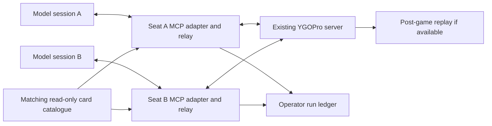

# Concept Zero

Status: PROPOSED — concept complete; duel and benchmark acceptance not yet run

Last updated: 2026-09-30

Decision context: [alignment.md](../alignment.md)

Evidence and dependency inventory: [concept-zero-research.md](concept-zero-research.md)

## Executive Decision

**PROPOSAL:** Build a small, operator-run benchmark of tool-assisted decision-making in Yu-Gi-Oh, using the existing community server at `koishi.momobako.com:2339` as the rules authority. Give each competing model its own seat-bound MCP connection, the same card-information and web-access policy, and a persistent conversation for one duel. Preserve the selected WindBot external-policy relay, qualifying it before adoption; retain the already installed `ygopro-msg-encode` as the bounded fallback. Build only the observation/decision adapter and the experiment record that existing components do not supply. Begin with fixed-deck, balanced-start duels, then investigate deck building and adversarial communication separately. Production means repeatable research runs with attributable outcomes and inspectable evidence. A compatible, version-identified server/card-data bundle is the route to reproducible campaigns; the public server is already useful for integration. Do not rebuild a game engine, simulator, graphical game client, agent framework, or leaderboard service. Claim performance in this declared environment, with reasoning as a research hypothesis—not a contamination-free or universal reasoning score.

## Problem and Evidence

Researchers need to know whether a model can make useful decisions over many dependent steps, revise a plan when an opponent interrupts it, and use information tools without receiving knowledge unavailable to its player. Correct answers to isolated questions do not establish that capability. A duel supplies an external outcome and a sequence of consequential choices, but also introduces deck strength, randomness, domain knowledge, and harness behavior as competing explanations.

Evidence IDs below resolve to dated primary sources, local source inspection, and explicit proof limits in the research ledger.

| ID | Claim | Evidence | Confidence | Impact |
|---|---|---|---|---|
| P-01 | `USER_DECISION`: reuse an existing server and client ecosystem; avoid rebuilding the game. | User brief; E-01 | High | Integration and experimental validity are the product boundary. |
| P-02 | `FACT`: this checkout implements lobby joining and codec tests, not a playable benchmark. | E-01, E-02 | High | A lobby success cannot close duel feasibility. |
| P-03 | `FACT`: the public endpoint accepts a room requesting no game clock and no banlist; it still advertises deck checks and shuffling. | E-02, E-04 | High for the observed handshake | Preserve the chosen target; separately verify actual deck admission, heartbeat handling, and play. |
| P-04 | `FACT`: inspected YGOPro server code performs player-specific masking and initial deck shuffling. | E-03 | High for inspected source | Reuse that boundary; deployed behavior still needs proof. |
| P-05 | `FACT`: Yu-Gi-Oh LLM projects and other game benchmarks already exist. | E-08–E-10, E-16–E-18 | High for existence | Novelty must come from a credible experimental protocol or new findings, not being the first game benchmark. |
| P-06 | `INFERENCE`: interrupted, partially observed duels can probe sustained decision-making. | E-03, E-16–E-19 | Medium; construct validity untested here | Measure meaningful choices and interruptions, not just turns or tool-call volume. |
| P-07 | `INVALIDATED` as an established claim: “no training-data contamination.” Fresh trajectories do not exclude learned card knowledge, memorized strategies, or retrieval. | E-17, E-20; public card sources in E-12/E-19 | High that immunity is unproven | Use held-out campaigns and provenance; describe contamination resistance as a hypothesis. |
| P-08 | `FACT`: interface and memory design can materially change game-agent results. | E-17, E-18 | High for those studies; transfer is an inference | Report the model, harness, tools, context policy, and budget together. |

## Users and Stakeholders

| Actor | Need | Constraints | Success signal |
|---|---|---|---|
| Model/agent researcher | Compare systems under a declared, inspectable protocol. | Stochastic outcomes; uncertain training exposure; model and harness confounds. | Can explain what a score measures and reproduce the analysis from retained records. |
| Benchmark operator / maintainer | Run and diagnose two seats economically. | Public-server behavior, provider access, long waits, and card-version drift. | Completes a declared batch; every failed attempt has an attributable status. |
| Adapter developer | Translate real prompts without inventing game rules. | Protocol lineage and partial observations. | Every supported blocking prompt is answered or fails visibly. |
| Yu-Gi-Oh domain reviewer | Check that observations and selected decks exercise the intended reasoning. | Text/script discrepancies; unlimited-format degenerate games. | Can inspect both seat traces and flag misleading task selection. |
| Server operator and upstream maintainers | Predictable load and supported integrations. | No service guarantee or operator agreement has been established. | Bounded automated sessions, compatible clients, identifiable versions. |
| Card-content rights holders / model providers | Appropriate use of their content and services. | Rights, access conditions, and logging restrictions require confirmation for distribution. | A release has identified permitted assets and provider operating conditions. |

`ASSUMPTION`: initial users are the project owner and a small research team. No buyer, commercial SLA, public matchmaking audience, or human-player product has been established.

## Goals, Non-Goals, and Constraints

| ID | Type | Statement | Evidence |
|---|---|---|---|
| G-01 | Goal | Complete real model-versus-model duels with only seat-authorized information and engine-authorized responses. | User brief; E-01 |
| G-02 | Goal | Measure gameplay effectiveness, interaction reliability, horizon, and cost with separate denominators. | P-06/P-08 |
| G-03 | Goal | Produce retained evidence that lets another operator inspect outcomes and experimental conditions. | `PROPOSAL`; E-08/E-18 |
| C-01 | Hard constraint | Keep the existing community-server route and target. No in-process rules engine in the benchmark adapter. | `USER_DECISION`; E-01 |
| C-02 | Hard constraint | Preserve the no-banlist format and intended extension-card access; `time_limit = 0`. Actual supported pool and long-wait behavior require qualification. | `USER_DECISION`; E-02/E-04 |
| C-03 | Hard constraint | Agents receive web and their own MCP tools only; other tools are disabled. Record provider-reported cutoff, or `unknown`. | `USER_DECISION`; E-01 |
| C-04 | Hard constraint | Server owns rules, priority, legality, and outcome. Player reads do not advance play. Optional choices belong to the model. | E-01/E-03 |
| C-05 | Preference | Qualify WindBot external policy first; use the existing JS codec if that route fails its bounded feasibility gate. Maintain one seat implementation after selection. | E-01/E-05/E-06 |
| C-06 | Constraint | Pin client, protocol, prompts, decks, and card data; obtain server/core/script identity for a reproducible campaign. Unknown remote provenance must remain explicit. | E-01/E-02/E-07 |
| N-01 | Non-goal | No custom engine, GUI, arbitrary engine lookahead, universal game framework, or parallel transport platform. | User brief; E-01 |
| N-02 | Deferred | Deck construction, sideboarding/Bo3, chat competition, narration, public rankings, RL training, and learned cross-game memory. | `PROPOSAL`: preserve these as separate experiments after the first slice. |
| N-03 | Non-goal | No claim of optimal play, general intelligence, guaranteed contamination immunity, or official tournament-ruling equivalence. | E-07/E-17/E-20 |

Fixed decks are an experimental control inside the requested format, not a new banlist. The first accepted deck set bounds the compatibility claim; it does not justify claiming support for every extension card.

## Unacceptable Outcomes

| Outcome | Why it matters | Prevention / detection |
|---|---|---|
| Hidden card identities or deck order reach the wrong model. | Invalidates the affected run. | Separate seat contexts; server-masked inputs; canary checks over every model-visible output; keep judge data inaccessible during play. |
| Adapter silently picks a strategic response or drops a blocking prompt. | Measures the adapter's policy or a protocol defect. | Explicit unresolved-decision ownership; count automatic responses; abort visibly on unsupported prompts. |
| Disconnects, version mismatches, or provider failures are reported as poor reasoning. | Produces false comparisons. | Distinct game, agent, adapter, provider, server, and budget outcomes. |
| Only successful or favorable duels survive in the report. | Hides selection bias. | Retain every scheduled attempt, retry, exclusion, and reason. |
| One model receives a different card version, hidden shared memory, or stronger tools. | Undermines the intended comparison. | Record and check each seat's complete configuration; label unmatched systems separately. |
| A public server changes while a campaign is called reproducible. | Combines different experiments. | Record provenance; end the cohort on known drift; classify unverifiable campaigns as exploratory. |
| Unlimited thinking becomes an unbounded bill or hung process. | Prevents regular operation. | Predeclare experiment resource ceilings; retain a censored/budget-exhausted outcome instead of inventing a game result. |

## Glossary

| Term | Meaning |
|---|---|
| Seat | One connected player and its authorized observation stream; not synonymous with first player. |
| Game chain | Yu-Gi-Oh's effect-resolution chain. Distinct from the benchmark's sequence of decisions. |
| Decision horizon | Number and dependence of meaningful player choices; neither packet count nor model reasoning-token count. |
| Pending decision | The unresolved engine/server request this seat may answer, including decisions on the opponent's turn. |
| Harness | The model runtime, prompt/context policy, tool dispatch, and resource controls surrounding a model. |
| Mechanical response | A response with exactly one legal continuation, including any ability to decline; no strategy is chosen. |
| Seat trace / judge artifact | Respectively, what one player was allowed to observe / privileged evidence for post-game verification. |
| Reproducible campaign | Identified environment and protocol plus retained inputs/results sufficient to rerun the procedure; identical model outputs are not promised. |

## Critical Journeys

| Journey | Current pain | Proposed experience | Evidence needed |
|---|---|---|---|
| Qualify an adapter without model spend | A successful join says little about game prompts. | Real simple legal-action policies complete duels through the same seat path later used by models. | Terminal outcomes, prompt inventory, both perspectives, and no silent fallback. |
| Run a comparison | Decks, starting order, tools, and context can dominate. | Operator selects a declared configuration, starts two isolated sessions, and gets a complete batch record. | Actual first-player allocation, locked decks, model/harness identity, and all attempts. |
| Recover from an invalid or obsolete action | A delayed response may refer to a consumed choice. | Clear error, unchanged game state, current pending decision available. | Real rejected-action and duplicate-response scenarios. |
| Explain a result | A win does not reveal whether the environment was valid. | Inspect separate seat histories, model/tool usage, terminal event, and available replay after the game. | Agreement between recorded outcome and server result; no player access to judge artifacts. |

## Quality Scenarios

These are proposed acceptance gates, not passed tests. Numeric starting points explicitly marked `ASSUMPTION` must be calibrated in the feasibility slice.

| ID | Scenario | Measure | Later architecture gate |
|---|---|---|---|
| Q-01 | Opponent-only cards appear in hand, facedown zones, Extra Deck, and selection prompts; cards are revealed and later concealed/shuffled. | Zero unauthorized identities or current hidden-instance mappings in either seat's outputs. Preserve legitimate memory of earlier public facts. | Real two-seat canaries and trace review; static server source is insufficient. |
| Q-02 | A duel emits optional effects, selections with constraints, interruptions, and card announcements. | Every encountered blocking request becomes an actionable pending decision or an explicit unsupported-protocol failure; zero default “yes”/first-choice substitutions. | Coverage against the selected server protocol plus real exercised scenarios. |
| Q-03 | A caller reads repeatedly, resubmits an old decision, or uses the other seat's handle. | Reads send no game responses; stale/wrong-seat actions change no game state; one accepted response consumes one decision. | Read/action boundary and isolation scenarios. |
| Q-04 | Model inference or web use outlasts the relay's existing 30-second timeout. | `ASSUMPTION`: demonstrate at least a 120-second pending decision, then a valid response, with heartbeats serviced independently; increase to the campaign wait budget. | Real server wait test, not merely a larger timeout setting. |
| Q-05 | A campaign stops through normal play, model refusal, provider error, disconnect, or resource cap. | Every scheduled attempt and every terminal classification is retained; zero silent replacements. | Failure attribution and cleanup at the real entry point. |
| Q-06 | A card's translated text or a remote dependency changes. | Every admitted card resolves in the declared catalogue; every scored cohort has a provenance record or an explicit exploratory label. | Card-data reconciliation and drift handling. |
| Q-07 | Only one response is legal, versus one candidate plus an optional decline. | Automate only the former; record automatic responses separately from strategic decisions and model calls. | Real optional-effect/decline scenarios. |
| Q-08 | A model conversation reaches its runtime's context limit. | Retain the context policy and compaction events; no unreported truncation, reset, or cross-seat memory. | Harness qualification before long-horizon claims. |

## Research Landscape

| Capability | Candidate route | Evidence | Verdict |
|---|---|---|---|
| Rules and player masking | Existing YGOPro/srvpro service | E-02–E-04/E-07 | Adopt the service. Its deployment identity remains a separate fact to establish. |
| A complete network player | Patched WindBot `ExternalPolicyClient` | E-06 | Adapt narrowly; it already receives decisions, but omits state detail and blocks while waiting. |
| Binary protocol | npm `ygopro-msg-encode` 1.3.0 | E-05 | Adopt for decoding; direct full-seat operation is a fallback, not already implemented. |
| MCP integration | Official SDK and protocol | E-14 | Adopt standard tooling in the existing Node stack; avoid a custom RPC protocol or provider framework. |
| Card information | Matching local CDB; public card APIs as supplementary research | E-11/E-12/E-19 | Adapt lookup to the server's catalogue. Generic online results cannot establish server support or exact script semantics. |
| Replay inspection | Server replay plus `ygopro-yrp-encode` | E-13 | Reuse where available; verify lineage/version compatibility before promising replayability. |
| Existing Yu-Gi-Oh agent/benchmark stacks | YGO-Bench, ygo-ai, ygo-harness, text-client reference | E-08–E-10/E-15 | Reuse ideas and narrowly relevant components; direct-core stacks do not satisfy the selected server boundary unchanged. |
| Experimental methods | BALROG, lmgame-Bench, PTCG-Bench | E-16–E-18 | Adapt methodology; no additional game framework is needed to run two MCP seats. |

## Adopt / Adapt / Build Decisions

| Capability | Decision | Rationale | Risk |
|---|---|---|---|
| Rules, cards' executable effects, legality, game outcome | **Adopt** existing server | Largest existing body of domain behavior; explicitly selected by the project. | Endpoint provenance, service availability, and extension-card quality. |
| Network player, codec, MCP, replay formats | **Adopt/adapt** existing implementations | Reuse protocol knowledge and supported extension points. | Relay is a carried patch; “few lines” is not a measured integration estimate. |
| Seat observation and pending-choice presentation | **Build a narrow adapter** | The exact observation boundary and decision semantics determine benchmark validity. | Stale state, hidden-instance tracking, omitted constraints. |
| Schedule, configuration record, outcome accounting | **Build a small run layer** | This is the differentiating experiment, not a new orchestration platform. | Uncontrolled harness behavior or incomplete denominator. |
| Model runtime and web access | **Adopt existing MCP-capable runtimes** | Avoid recreating agents and their provider integrations. | Qualification must prove tool restrictions, context behavior, and usable logs. |
| Rich web lab, custom simulator, training/search agent | **Defer/reject for this slice** | Does not resolve the first uncertainty: valid model decisions through a real server. | Reopen only for a named research requirement. |

## Candidate Concepts

### Candidate A: Two instrumented seats on the existing community server — selected

The operator selects two model configurations and decks, runs their independent MCP seats in one room, and inspects outcomes and traces. The service owns the complete game; the local project owns tool-facing observations, pending choices, and experiment accounting. Reuse WindBot, the JS codec, existing model runtimes, and server replay where supported. No game-engine deployment or visual client is required. Begin with one active duel at a time on an operator machine or small runner host.

The strongest risk is an otherwise playable service whose data versions or long-wait behavior cannot support trustworthy comparisons. Falsify the route with real full-duel/long-wait qualification and a request for compatible versioned card data. Without the provenance needed for reproducibility, the output remains explicitly exploratory. This limits the claim rather than disguising the uncertainty.

### Candidate B: Operate a pinned instance of an existing server — conditional alternative

The player experience and seat adapter remain the same, but the operator also runs a compatible server/core/script/CDB bundle, using upstream deployment machinery. This gives control over versions, shuffle configuration, retention, and service capacity. It still adopts the game implementation; it adds build, patch, security, and asset-distribution responsibilities. Existing srvpro Linux/container material supplies a credible starting route, not a proven compatible image for this endpoint.

Do not silently substitute this for the selected public target. Reopen it only if Candidate A cannot provide a required capability and the project chooses stronger environment control. Falsifier: a pinned upstream deployment cannot complete the same seat acceptance or cannot legally/practically supply the required card bundle without a substantial fork.

### Candidate C: Extend an embedded-engine benchmark kit — rejected for the current product

Adopting YGO-Bench or ygo-harness wholesale would supply local duel control and parts of evaluation/replay without a public service. The operator would instead run native-core dependencies and accept responsibility for player masking, deck setup, and engine lifecycle. This is attractive for a future controlled-puzzle or search study, but conflicts with the explicit server decision and inherits a different core lineage and observation boundary.

Source findings and historical reports identify enough mismatch to reject direct adoption now; they do not prove every future release unusable. Reconsider only after a changed product requirement and independent real-run evidence of information isolation, strategic-choice preservation, and protocol/data compatibility.

## Adversarial Review

| Finding | Revision |
|---|---|
| “Fresh game” does not make card knowledge or strategies unseen. | Replace contamination immunity with a documented exposure-control hypothesis; hold out campaigns and separate retrieval from pretraining knowledge. |
| A no-banlist duel may end before the second player makes a useful choice. | Keep the chosen format; report first-player outcomes and meaningful-decision distributions. Use a declared fixed-deck sample to test interaction before broadening the pool. |
| Many menu confirmations can look like a long reasoning horizon. | Count packets, model calls, mechanical responses, and meaningful choices separately. Do not reuse a showcase's decision count as a typical duel length. |
| Server masking is valuable but not a proof about every model-visible output. | Verify the deployed path, cached labels/handles, error messages, logs, and cross-seat routing. Public card lookup may describe any card; it must not reveal that a hidden instance is that card. |
| A single candidate may still allow declining activation. | Determine unique legal continuation from the full prompt; optional effects remain model decisions. |
| Zero game clock does not disable heartbeat or relay timeouts. | Require the independent network/wait scenario in Q-04. |
| Native web and runtime compaction differ among models. | Freeze what can be matched; record remaining differences and call the result an agent-system comparison. |
| Reuse can import needless scope and licensing obligations. | Reuse components, not entire applications; check component licenses independently. srvpro itself is AGPL, so “avoid EDO to avoid all AGPL” is invalid. |

## Selected Concept HLD

### Boundary and data flow

Web access is supplied by each qualified model runtime under the same declared policy. The diagram's boxes are ownership boundaries, not a requirement for separate services. One small local runner plus the two existing model sessions and necessary relay processes is sufficient. The operator ledger and post-game replay are not model tools during play.

**Game service:** authoritative state, legal prompts, shuffle, priority, and terminal verdict. A client version number identifies a wire expectation, not the deployed core or script hashes. The actual server fingerprint and data bundle must be obtained for reproducible campaigns. A known drift ends a cohort; never relabel earlier runs with later versions.

**Seat adapter:** translate that seat's received messages into useful current state, history, and pending choices. Preserve dynamic stats, phase, zones, chain context, optionality, cardinality, ordering, and effect identity. Keep bounded selections as candidates plus constraints instead of enumerating all combinations. Bind requests to the connected seat; there is no arbitrary perspective selector or arbitrary engine query. Reads cannot advance play, although incoming server events can naturally change the observed state. An accepted response consumes its decision identity; unsupported prompts and uncertain delivery produce explicit errors rather than speculative retries.

**Information tools:** use a read-only catalogue matching the server, retaining English PSCT where available and identified Japanese/source text for extensions lacking verified English text. Translation provenance and uncertainty are visible. Printed card information is distinct from live modified stats. A catalogue can explain a card named by the model, but cannot identify an unknown opponent instance. Rotate handles when the normal client loses track of identity; retain the model's legitimate knowledge of past public reveals. Do not implement a simulator or offer privileged lookahead.

**Run layer:** configure and start the two existing runtimes; lock decks for the duel; service the seat lifecycle; preserve separate player traces, tool outcomes, configuration, usage, and terminal evidence. Failed protocol sends, refused actions, provider failures, and game losses are different events. Retries are explicit attempts linked to their predecessors. No database server, queue, accounts system, or scheduler cluster is justified for the first operator-run release; local append-only files and immutable completed-run bundles suffice.

### What the benchmark measures

`PROPOSAL`: the primary score is an engine-adjudicated outcome under a named model/harness/deck/tool configuration. It is evidence of situated decision-making. Attribution to general reasoning requires additional experiments and external validation.

| Dimension | Evidence to report | Claim limit |
|---|---|---|
| Gameplay effectiveness | Wins, draws, losses; matchup matrix; results by deck and actual first player; uncertainty interval. | A stronger deck or favorable draw can win without better reasoning. |
| Sustained decisions | Meaningful choices per seat, decisions on the opponent's turn, chain interruptions, turns, completion, and context changes. | Length alone is not difficulty or successful planning. |
| Tool use | Card/web queries, valid and invalid responses, stale requests, recovery, usage and latency. | More tools or fewer calls is not automatically better. |
| Reliability | Scheduled attempts, completed games, protocol/provider/server failures, caps and censored runs. | Completed-game win rate must be shown with completion/failure denominators. |
| Resources | Actual input/output/reasoning usage where exposed, cached-token usage, web charges, wall time, and billed cost where available. | Unknown usage stays unknown; hypothetical cache-normalized cost is not actual spend. |

**Experimental control:** begin with fixed-deck Bo1 duels and no opponent chat in model context (`PROPOSAL`). Use fresh conversations between duels and persistent context within a duel. Start with mirror-deck comparisons; when using different decks, cross deck assignments with actual first-player allocation. Record seat index separately. Schedule equal exposure to starting roles rather than inferring it from swapped connections. Verify that the service can realize the schedule; do not discard inconvenient draws or starts. A public server without seed control permits repeated randomized comparisons, not a promise of identical opening hands. Keep cohort assignments fixed before observing results, interleave model pairings, and freeze prompts and budgets within the campaign.

Report raw counts and an interval appropriate to the sampling unit. Decisions inside a duel are not independent trials. Repeated deck/start blocks must be treated as blocks when estimating uncertainty. A four-game demonstration is acceptance of a workflow, not a powered ranking. Choose campaign size and stopping policy after measuring variance and cost, before the scored campaign; do not invent a universal required sample count or stop when a desired model leads. Pairwise outcomes come before a single Elo-style score, since matchup effects need not be transitive.

**Contamination and knowledge:** reserve unseen deck combinations/assignments and fresh game randomness for held-out campaigns; keep scored prompts unchanged and separate development runs from confirmation runs. Delay publishing held-out trajectories until evaluation ends. Record card publication/translation dates and provider-reported cutoff where known, but do not treat cutoff claims as training-corpus audits. New cards plus enabled web access measure acquisition and application of new information, not proof that a model has never encountered it. A later web-off ablation or knowledge-controlled study may improve attribution; it does not replace the user's web-enabled default. Cross-game learning and prompt evolution require a separate declared track.

### Operation, cost, and failure behavior

Start with one duel in flight; no throughput claim or public-server service agreement exists. Confirm automated-use conditions and expected capacity before sustained campaigns. Use a qualified Linux relay host if native macOS compatibility fails, or select the already allowed direct-codec route after the bounded relay spike. Do not carry both implementations indefinitely. Preserve dependency pins and the minimal patch set; qualify updates on a new campaign boundary.

Costs are primarily model calls, growing context, reasoning output, retrieval, and retries, plus any runner/server hosting. No representative duel cost has been measured. Estimate a campaign from measured pilot usage and dated provider rates, including cache misses and incomplete attempts. Set total run/campaign limits in advance. These are experiment ceilings, distinct from the zero in-game clock. If a ceiling ends a duel, retain the engine's observed state and classify the experiment as censored/budget-exhausted; do not silently award a game win.

Two seats must not share conversation memory or read each other's logs. Chat is untrusted opponent content and is excluded from the proposed first track. Web content is also untrusted; qualifying the runtime must demonstrate the allowed tool surface, not merely describe it in a prompt. Provider credentials remain in the host's normal secret mechanism and never enter run bundles. Dependency licenses, patch notices, and card-data redistribution rights need component-level treatment; an OSS code license is not an asset-rights determination. This is an identified distribution question, not a new requirement to implement auth or a compliance platform.

## First Production Slice

The smallest useful release is an operator command that runs a declared fixed-deck comparison through two isolated model clients and produces an inspectable result bundle. Its accepted scope is the exercised protocol, deck set, server/data identity, and qualified runtimes.

1. **Zero-model feasibility:** real legal-action policies complete a duel through the selected seat route. Exercise both seats, optional reactions, constrained selections, the long-wait boundary, terminal transitions, and the Q-01/Q-03 isolation scenarios using real game inputs. These policies are real players used to qualify the adapter; their results prove no model capability. One duel cannot certify every message family or card.
2. **Model acceptance:** two independent MCP clients complete a small predeclared set with the same declared tool policy and recorded context behavior. `ASSUMPTION`: at least a two-start mirror pair; if using two different decks, a four-condition deck/start block. Retain every attempt, including failures, and reconcile each accepted game with the server's terminal event.
3. **Repeatable operator use:** a second run can be launched from the retained configuration without editing implementation. Identify the compatible data bundle and server provenance; capture/reopen a native replay if this service provides one, or clearly limit inspection to the recorded seat/terminal evidence. Demonstrate cleanup and bounded cost behavior.

This slice establishes a functioning research instrument, not a statistically resolved model ranking or unrestricted all-card support. Unknown server provenance permits exploratory pilot evidence only; a reproducible-campaign claim remains blocked until resolved. Detailed implementation and task ordering belong to `arch-roadmap`.

## Open Questions and Spikes

| Question | Why it matters | How to resolve | Owner / next command |
|---|---|---|---|
| S-01: Can the pinned WindBot relay run on the chosen host and expose complete state without blocking heartbeats? | Controls the size of the adaptation. | Build/run the real relay and Q-02/Q-04 scenarios; if it fails, select the direct codec fallback using the same acceptance boundary. No “small patch” estimate yet. | Adapter maintainer; carry into `arch-roadmap`. |
| S-02: Which exact core/scripts/CDB/extensions run on port 2339? | Wire version is insufficient for matching card text or reproducibility. | Obtain an operator-provided manifest and compatible catalogue; validate the admitted deck/card set. If unavailable, keep the pilot exploratory and reopen Candidate B only by an explicit project decision. | Benchmark/server operators; operator-supplied data may require human coordination. |
| S-03: Which prompts and game paths does the real endpoint/relay support? | Unknown prompts can masquerade as weak play. | Inventory the chosen protocol and exercise it with real games; record tested and untested families without claiming universal coverage. | Adapter maintainer; zero-model acceptance. |
| S-04: Can actual starting order be controlled and live games/replays retained? | Needed for balancing and post-game verification. | Verify pre-duel selection, actual first player, and replay availability; do not assume seed injection or replay portability. | Benchmark operator; real two-seat qualification. |
| S-05: Which two model runtimes satisfy web+MCP-only access and context accounting? | Native clients may differ materially. | Qualify actual tool lists, per-seat isolation, budgets, and compaction logs. Select exact versions only when demonstrated. | Experiment owner; harness qualification. |
| S-06: Do chosen decks produce enough meaningful interrupted play? | No-banlist first-turn wins could defeat the research question. | Pilot declared decks, inspect decision/start distributions with a domain reviewer, then freeze the scored deck sample. Preserve short games in reporting. | Experiment owner + domain reviewer; pilot review. |
| S-07: What precision and spend can a campaign support? | Determines an honest comparison size. | Measure pilot variance, completion and cost; predeclare sample/stopping policy before confirmation. | Experiment owner; campaign design after feasibility. |
| S-08: What can be distributed, and what service load is supported? | Limits public packaging and sustained operation. | Confirm server operating conditions, component notices, and permitted card/text/replay assets; publish minimal software and metadata until resolved. | Project owner; human/operator input before public distribution or sustained use. |

None prevents writing this proposed concept. S-01/S-03 and Q-01/Q-03 block real seat acceptance; S-05 additionally blocks model acceptance. S-02 blocks a reproducible-campaign claim, but not an explicitly exploratory pilot with a usable catalogue. S-04's starting-order question affects balanced comparisons; missing native replay limits playback claims, not otherwise valid recorded games. S-06–S-07 precede a meaningful ranking. No model tournament, relay implementation, server deployment, or operator outreach was performed for this document.

## Handoff to Architecture and Roadmap

Next command: **`arch-roadmap`**.

Derive `docs/architecture.md` and `docs/roadmap.md` from this concept. Preserve the existing-server choice, the fallback boundary, the web+MCP permission policy, and the requested format. Carry Q-01–Q-08 and S-01–S-08 into the relevant gates; separate transport feasibility, real duel acceptance, model acceptance, and scientific validation. Define only one seat transport after the relay decision. Keep the first delivery bounded to the operator-run fixed-deck slice and its evidence. Reopen the concept only for a demonstrated capability gap, a changed research question, or a justified need to operate a pinned existing server.
