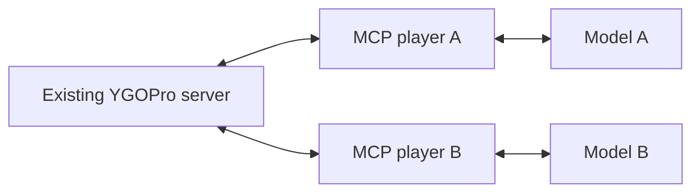

# Concept Zero

Status: PROPOSED — revised to the user's 2026-10-04 scope decisions

Last updated: 2026-10-04

This is the current concept. The 2026-10-04 review supersedes conflicting restrictions in the earlier [alignment discussion](../alignment.md) and the first concept draft. Supporting sources are in [concept-zero-research.md](concept-zero-research.md).

## Executive Decision

**USER_DECISION:** Let two models play Yu-Gi-Oh through a thin MCP interface to the existing YGOPro server at `koishi.momobako.com:2339`. Models construct decks, play a Bo3 match, change side-deck cards between games, and chat with each other. Use the server's existing no-banlist mode, extension cards, unlimited game clock, match handling, and game records. Reuse YGOPro's deck representation, submission, and native replay facilities. The project's work is to expose those capabilities to models. The operator starts the match; the models make the gameplay decisions without human co-playing.

## Problem and Evidence

The research idea is to observe how models combine card knowledge, tool use, long sequences of decisions, adaptation to an opponent, and communication in a real game. Deck construction and sideboarding are part of that problem. A fixed-deck-only test would omit capabilities the project wants to study.

| Claim | Evidence | Consequence |
|---|---|---|
| `FACT`: deck editing, match progression, chat, and replay already exist in the YGOPro ecosystem. | R-02–R-05 | Expose existing functionality; do not create replacement subsystems. |
| `FACT`: this repository currently joins a lobby and leaves; it does not yet connect model players. | R-01 | The next useful work is the MCP connection and complete match flow. |
| `FACT`: other game and Yu-Gi-Oh benchmarks exist. | R-08/R-09 | Learn from them without importing their entire framework. |
| `INFERENCE`: fresh games and newly released cards can make exact-answer memorization less useful. | R-09 | This is a reason to investigate the game, not a claim of zero training contamination. |

## Users and Stakeholders

The primary user is the researcher who chooses the models, starts matches, and examines the results and native replays. Models are the players. The community server supplies the game; its existing clients and libraries supply the functions being exposed. There is no requirement for an operator to approve moves, edit a model's decisions, or participate as a player.

## Goals, Non-Goals, and Constraints

| Type | Scope |
|---|---|
| Required | Card lookup and model-controlled construction of Main, Extra, and Side Decks using existing deck facilities and formats. |
| Required | Two model players complete server-hosted Bo3 matches, including sideboarding and the normal choices between games. |
| Required | Bidirectional in-game chat exposed to the models. |
| Required | Use the server's no-banlist format, available extension cards, and `time_limit = 0`. These are configuration choices already supported by the server. |
| Required | Use native game records and replays for reviewing matches. |
| Operating choice | Follow normal server and card updates; update local client/card lookup compatibility when needed. No requirement to freeze the environment. |
| Operating choice | Use the model runtime's normal tools and session behavior. This project does not impose a tool allowlist, collect cutoff declarations, or audit runtime permissions. |
| Not built | Rules engine, separate replay recorder, experiment ledger, custom deck/sideboarding validator, hash manifests, canary system, or independent action-permission machinery. |
| Deferred | Narration, public rankings, RL training, and learned cross-game memory. Deck construction, Bo3, and chat are in the first useful release. |

Use the ordinary server-provided player information. Add local redaction only if an actual disclosure is confirmed and existing server/client fixes or another existing component cannot resolve it. Speculative disclosure scenarios do not create development work.

## Unacceptable Outcomes

The adapter must not leave the model unable to perform a required game operation, hide a server error as a successful move, or discard the native replay needed to review the match. Address these as ordinary integration defects when they occur. Do not build a second rules or enforcement layer around the server.

## Glossary

| Term | Meaning |
|---|---|
| Duel / game | One game of Yu-Gi-Oh. |
| Match / Bo3 | The server's match mode, including its handling of wins, draws, sideboarding, and subsequent games. |
| Seat / relay | The existing network client connection through which one model plays. |
| MCP adapter | Tool-facing access to the existing player's state, choices, deck operations, and chat. |
| Replay | The native game record used by the existing replay viewer. |

## Critical Journeys

| Journey | Model/operator experience | Existing capability to reuse |
|---|---|---|
| Prepare | The model searches cards, builds its Main/Extra/Side Decks, and submits them. | Card data/search, deck editing and serialization, normal deck submission. |
| Play and communicate | Each model receives game information, answers the game's prompts, and exchanges chat. | Player connection, game messages, response and chat packets. |
| Adapt between games | The model changes its deck using its Side Deck and continues the match. | Server match flow and deck resubmission. |
| Review | The operator sees the result and opens the game record. | Native match information and replay saving/playback. |

## Quality Scenarios

Ordinary successful use is the measure: a submitted model-built deck reaches the game, chat reaches the opponent, sideboard changes are used in the next game, and a completed match can be reviewed in the existing replay viewer. The relay keeps handling the normal connection traffic while a model thinks. These describe the user journey; they do not require a separate certification framework, universal protocol-coverage campaign, or staged prerequisites before connecting models.

## Research Landscape and Adopt / Adapt / Build Decisions

| Capability | Existing route | Decision | Project work |
|---|---|---|---|
| Game, card pool, room settings, Bo3 | Community YGOPro/srvpro server | **Adopt** | Configure and join the desired room. |
| Network player | WindBot `ExternalPolicyClient` in `third_party/ygo-ai` | **Adapt** | Expose game information and the currently unforwarded player operations. |
| Protocol and deck format | `ygopro-msg-encode`, its deck codec, existing YGOPro deck code | **Adopt** | Connect tool operations to existing encoders and deck submission. |
| Card search / deck editing | Existing catalogue, deck builder, and card/deck tool references | **Adapt** | Let the model search and edit its ordinary deck through MCP. |
| Chat | Existing chat messages in both directions | **Adopt** | Deliver received chat to the model and send its messages. |
| Match records / replay | Native server/client replay support | **Adopt** | Retain or expose the existing replay output and open it with the normal viewer. |
| Model access | Existing MCP-capable model runtimes | **Adopt** | Connect each model to its player interface. |
| Missing connection between those parts | A small MCP adapter | **Build** | Translate tool requests and game messages; surface ordinary errors. |

The existing deck builder is a graphical client feature, not an already exposed MCP endpoint. The thin adaptation is to make its deck-editing capabilities available through tools, reusing the existing Main/Extra/Side representation, file format, and submission path. This does not require a new deck-management application or a custom legality checker. R-02 identifies concrete reusable code.

## Candidate Concepts

**A. Existing server plus MCP-accessible player — selected.** Models use deck building, play, sideboarding, chat, and native records through the current server. WindBot supplies the established player path; the installed JS codec remains the existing fallback if it avoids unnecessary relay work. Choose one implementation rather than maintaining both. This fits the requested experience and keeps custom code small. The practical question is how much of the existing player needs forwarding.

**B. Automate the graphical client — not selected.** This directly exposes the deck editor and replay viewer but adds screen and input automation to every model interaction. It is useful for manual viewing; the chosen model interface is MCP over the existing protocol. Reconsider only if an essential capability is materially easier to expose through the client.

**C. Adopt an embedded-engine benchmark — not selected.** YGO-Bench and similar projects provide local engines and evaluation tooling, but move game hosting and associated integration into this repository. Their extra functionality does not justify replacing the already selected server route.

## Adversarial Review

The previous concept treated exact experimental reproduction and hypothetical misuse as first-release requirements. Neither follows from the requested autonomous model match. Native replay covers game review; native match mode covers Bo3; existing deck handling covers submission and sideboarding. The remaining problem is access through MCP.

Version records and frozen configurations can help investigate differences between historical experiments. They are unnecessary for connecting models and reviewing their games, so this release includes no version-reporting subsystem or freeze policy. Fixed decks could answer a narrower experimental question later, but are not a prerequisite for model-built decks. New infrastructure should be justified by a concrete missing capability encountered in this workflow.

## Selected Concept HLD

The MCP players reuse the selected relay and codec internally. They present the game information the normal player connection already receives and expose deck operations, gameplay responses, sideboarding, and chat. The underlying client/server handles normal game behavior; the adapter is a translation layer.

Use existing card data/search for deck construction and card reading. Follow normal card updates as the server evolves. A missing new card or incompatible packet is an integration issue to fix with the current upstream data/client; it is not a reason to demand a server manifest or build a provenance service.

Use YGOPro's normal game records and replays as the record of play. If the relay receives replay bytes, preserve that native output instead of recording a second game history. Model-runtime conversation history can be consulted when model tool use needs inspection. No custom event store, trace bundle, replay UI, or experiment database is required.

The initial operating model is an operator's machine running two existing model sessions and their MCP player connections to the public server. Costs are ordinary model/runtime usage and the small client process. No tournament platform, capacity target, or new budget-control subsystem is required. Return server/client errors so the model or operator can address the actual failure.

A match result measures the participating agents' combined deck-building, play, sideboarding, communication, and tool-use performance. Native results and replays are enough to begin investigating that performance. Formal rankings and claims about general reasoning can be considered after useful games exist; they do not dictate this interface's first release.

## First Useful Release

The first useful release lets the operator start two model players that construct and submit decks, play a server-hosted Bo3 match, exchange chat, make sideboard changes between games, and leave native game records/replays for review. The operator does not make gameplay decisions for either model.

This complete experience is the delivery target. A single-game connection can be a development step, but does not defer deck construction, sideboarding, or chat from the requested release. Check that experience by running it; fix concrete integration failures rather than creating a separate qualification programme.

## Open Integration Questions

| Question | Smallest way to resolve it |
|---|---|
| Which existing deck-editing/card-search functions are easiest to expose? | Use the deck representation and submission already present; connect the available card source. No new deck service. |
| Which relay callbacks still need to reach the model? | R-06 identifies the current gaps: game information, pre-duel choices, sideboarding, chat, and replay output. Adapt those paths. |
| Does the relay run conveniently on the chosen host? | Use its supported runtime; take the existing JS-codec fallback if that reduces the total work. |

There is no unresolved product choice preventing this concept. The implementation is currently lobby-only, so the model match itself has not been demonstrated.

## Handoff to Architecture and Roadmap

Next command: **`arch-roadmap`**.

Derive a small architecture and roadmap for the required model-built-deck → Bo3 play and chat → sideboarding → native replay journey. Preserve the existing server and its normal updates. Carry forward only the adapter work identified here; do not reintroduce the removed audit, pinning, permission, or replay infrastructure under new names.
