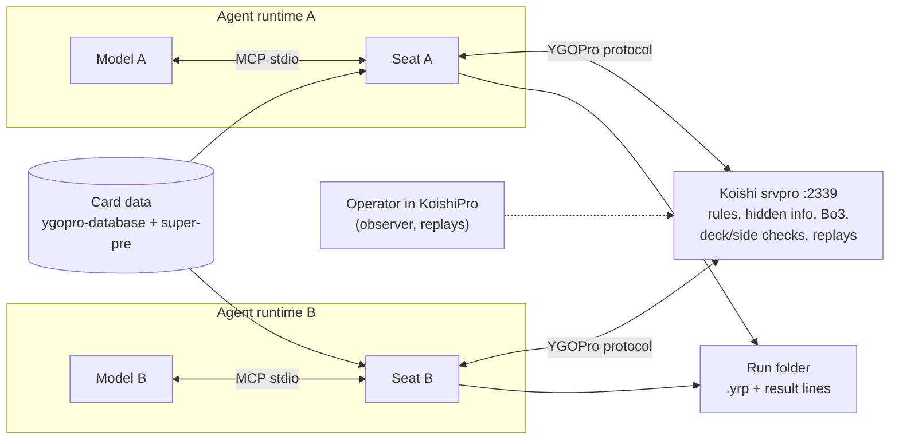

# Concept Zero

Status: ACCEPTED (2026-10-07, after peer#3's review)

Last updated: 2026-10-07

## Executive Decision

`PROPOSAL`: build one component, the **seat**: an MCP server that is a headless YGOPro client for one model. Each model runs in its usual agent runtime (Claude Code, Codex CLI, any MCP client) with its own seat. Both seats join one room on `koishi.momobako.com:2339` named `M,TM0,NF#<id>`, which gives Bo3, no game clock and no banlist. The server already runs the game: rules, shuffling, hidden information, deck and side-deck checks, first-player choice, match result and replays. The seat only translates. Server messages become board, prompt and chat text for the model. The model's choice becomes a protocol response, and deck edits become a deck submission. The seat extends the existing Node lobby client. It uses the libraries srvpro itself depends on (`ygopro-msg-encode`, `ygopro-deck-encode`, `ygopro-yrp-encode`), plus `ygopro-cdb-encode` for card search. The first release includes model-built decks, Bo3 with siding, and chat in both directions. Narration, rankings, RL and cross-game memory are deferred. The project does not build a WindBot relay, an orchestrator, a ledger, validators, canaries, hashes, version pinning, tool restrictions or redaction.

```text
Koishi server  ⇄  seat (MCP, Node)  ⇄  agent runtime  ⇄  model
```

## Problem and Evidence

Two LLMs should play real Yu-Gi-Oh! against each other the way two people do online: build a deck, play a Bo3, side between games, and talk. The game, the server, the deck formats and the replay viewer already exist. What is missing is a client that a model can drive through tools.

| ID | Finding | Source | Consequence |
|---|---|---|---|
| E-01 | `FACT`: the repo's Node client joins a lobby on 2339 with `ygopro-msg-encode` 1.3.0, then leaves. It has no deck, duel or MCP code yet. | [lobby probe](../../src/bin/probe.js) | The seat grows from this client. |
| E-02 | `FACT`: a live join on 2026-10-04 used `YGO_ROOM='M,TM0,NF#p26f14e2' npm start` and returned `mode 1`, `timeLimit 0`, `lflist 0`, rule 5, MR5, deck check and shuffle on, version `0x1362`. On 2026-09-30 the default room was a single duel with a 240 s clock. | Live run | The room name sets the format, so the server needs no changes. |
| E-03 | `FACT`: srvpro's room flags: `M` gives Bo3, `TM0` gives no clock, `NF` gives no banlist. | [srvpro room parser](https://github.com/mycard/srvpro/blob/c16bbccddbd5f3304e6e1d93118db45e8868003f/ygopro-server.coffee#L1387-L1437) | Same as E-02. |
| E-04 | `FACT`: the server already does all the validation. It checks the deck on ready and reports the error type plus the card code or count. A side submission must keep the Main/Extra/Side sizes and the same cards (`LoadSide`), or it gets `SIDEERROR`. An illegal answer gets `MSG_RETRY` and the same prompt again. | [ready check](https://github.com/Fluorohydride/ygopro/blob/bfa360f631010f9eb9d74d1054e2732388de7860/gframe/single_duel.cpp#L243-L266), [`LoadSide`](https://github.com/Fluorohydride/ygopro/blob/bfa360f631010f9eb9d74d1054e2732388de7860/gframe/deck_manager.cpp#L223-L247), [side submit](https://github.com/Fluorohydride/ygopro/blob/bfa360f631010f9eb9d74d1054e2732388de7860/gframe/single_duel.cpp#L305-L322), [retry](https://github.com/Fluorohydride/ygopro/blob/bfa360f631010f9eb9d74d1054e2732388de7860/gframe/single_duel.cpp#L583-L590) | No local validator. The seat shows server errors to the model in words. |
| E-05 | `FACT`: the server hides the opponent's secrets per player before sending. In card-selection prompts it also zeroes the code of every opponent-controlled candidate, face-up cards included. | [selection masking](https://github.com/Fluorohydride/ygopro/blob/bfa360f631010f9eb9d74d1054e2732388de7860/gframe/single_duel.cpp#L707-L726) | No redaction layer. The seat names those candidates from its own board by (controller, location, sequence), like the stock client. |
| E-06 | `FACT`: Bo3 is built into the server. Rock-paper-scissors decides who chooses first. After each duel the server sends `CHANGE_SIDE` and the loser picks who goes first. `DUEL_END` closes the match, after two wins or earlier on a match kill. | [RPS and first player](https://github.com/Fluorohydride/ygopro/blob/bfa360f631010f9eb9d74d1054e2732388de7860/gframe/single_duel.cpp#L352-L400), [match end](https://github.com/Fluorohydride/ygopro/blob/bfa360f631010f9eb9d74d1054e2732388de7860/gframe/single_duel.cpp#L519-L530), [side request](https://github.com/Fluorohydride/ygopro/blob/bfa360f631010f9eb9d74d1054e2732388de7860/gframe/single_duel.cpp#L545-L546), [loser picks](https://github.com/Fluorohydride/ygopro/blob/bfa360f631010f9eb9d74d1054e2732388de7860/gframe/single_duel.cpp#L566-L570) | No scheduler or first-player balancing to build. |
| E-07 | `FACT`: each duel produces a `.yrp` sent to both players. It holds the seed, both decks and every response. srvpro's default `replay_delay` holds match replays until the match ends, then sends them right after `DUEL_END`. | [replay header](https://github.com/Fluorohydride/ygopro/blob/bfa360f631010f9eb9d74d1054e2732388de7860/gframe/single_duel.cpp#L425-L461), [send](https://github.com/Fluorohydride/ygopro/blob/bfa360f631010f9eb9d74d1054e2732388de7860/gframe/single_duel.cpp#L1441-L1452), [srvpro delay](https://github.com/mycard/srvpro/blob/c16bbccddbd5f3304e6e1d93118db45e8868003f/ygopro-server.coffee#L1210-L1220), [after `DUEL_END`](https://github.com/mycard/srvpro/blob/c16bbccddbd5f3304e6e1d93118db45e8868003f/ygopro-server.coffee#L3111-L3126), [default](https://github.com/mycard/srvpro/blob/c16bbccddbd5f3304e6e1d93118db45e8868003f/data/default_config.json#L30) | The replay is the record, and the seat saves the bytes. Replays open in KoishiPro or YGOPro. |
| E-08 | `FACT`: srvpro's optional heartbeat sends `STOC_TIME_LIMIT` and expects `CTOS_TIME_CONFIRM` within `wait_time`; it is off by default. The optional `side_timeout` kicks slow siders and is also off by default. Reconnect is on by default for 90 s and requires the same player and deck. Measured on 2339 (2026-10-07/08): the side timer is 3 minutes, a dropped seat was held for 298 s, and no heartbeat `TIME_LIMIT` was seen. | [heartbeat](https://github.com/mycard/srvpro/blob/c16bbccddbd5f3304e6e1d93118db45e8868003f/ygopro-server.coffee#L1166-L1185), [confirm](https://github.com/mycard/srvpro/blob/c16bbccddbd5f3304e6e1d93118db45e8868003f/ygopro-server.coffee#L3644-L3661), [side timer](https://github.com/mycard/srvpro/blob/c16bbccddbd5f3304e6e1d93118db45e8868003f/ygopro-server.coffee#L3750-L3770), [reconnect](https://github.com/mycard/srvpro/blob/c16bbccddbd5f3304e6e1d93118db45e8868003f/ygopro-server.coffee#L1015-L1029), [defaults](https://github.com/mycard/srvpro/blob/c16bbccddbd5f3304e6e1d93118db45e8868003f/data/default_config.json#L127-L137) | The seat answers keepalives itself, whether or not the model is thinking. |
| E-09 | `FACT`: `ygopro-msg-encode` decodes all server packets and about 85 game-message types; `MSG_UPDATE_DATA` becomes per-card state. It builds responses for all 18 prompt types with `prepareResponse`, including picking one effect of a card via `desc`. srvpro depends on it, `ygopro-deck-encode` and `ygopro-yrp-encode`. All three are MIT and maintained by Nanahira, who also runs the Koishi server (the npm maintainer address is on `momobako.com`). | [response guide](https://github.com/purerosefallen/ygopro-msg-encode/blob/9a53630de5a31f29229866c19697684b9baa4267/MSG_RESPONSE_GUIDE.md), [`UPDATE_DATA`](https://github.com/purerosefallen/ygopro-msg-encode/blob/9a53630de5a31f29229866c19697684b9baa4267/src/protos/msg/proto/update-data.ts), [srvpro deps](https://github.com/mycard/srvpro/blob/c16bbccddbd5f3304e6e1d93118db45e8868003f/package.json#L35-L37) | The seat uses the same protocol code as the server and needs no relay. |
| E-10 | `FACT`: the parts of a headless deck builder exist. `ygopro-deck-encode` 1.0.16 handles YDK, `ydke://`, KoishiPro deck codes and the `UPDATE_DECK` payload. `ygopro-cdb-encode` 1.1.1 searches a CDB by name, text, type, attribute, race, level and ATK/DEF, using sql.js with no native build. | [deck-encode](https://www.npmjs.com/package/ygopro-deck-encode), [cdb-encode](https://www.npmjs.com/package/ygopro-cdb-encode) | Deck tools are thin wrappers. |
| E-11 | `FACT`: card data changes often. MyCard `ygopro-database` was last committed on 2026-09-24. The super-pre list was modified on 2026-10-03 and is updated as new cards are announced. | [ygopro-database](https://github.com/mycard/ygopro-database), [super-pre list](https://cdn02.moecube.com:444/ygopro-super-pre/data/test-release.json) | Refresh card data before play; never pin it. |
| E-12 | `FACT`: the WindBot `ExternalPolicyClient` sends raw message bytes out and expects raw response bytes back, so the MCP side would still need the full decoder and encoder. It forwards card IDs only and answers RPS and first-player with WindBot's AI. On side it resubmits the same deck. It discards replays, only logs chat, and blocks the packet loop while waiting, with a 30 s timeout. It needs .NET Framework 4.8/Mono. | [policy client](https://github.com/jinyan438/ygo-ai/blob/3ee262c4ded15fade7dfc2e41f6a1e922a6da4e7/skill/resources/ygopro2-bridge/windbot/source/Game/AI/ExternalPolicyClient.cs#L29-L62), [routing](https://github.com/jinyan438/ygo-ai/blob/3ee262c4ded15fade7dfc2e41f6a1e922a6da4e7/skill/resources/ygopro2-bridge/windbot/source/Game/GameBehavior.cs#L35-L100), [lobby handlers](https://github.com/jinyan438/ygo-ai/blob/3ee262c4ded15fade7dfc2e41f6a1e922a6da4e7/skill/resources/ygopro2-bridge/windbot/source/Game/GameBehavior.cs#L210-L338) | Rejected as the seat path (Candidate B). |
| E-13 | `FACT`: the stock client automatically passes chain windows that have nothing to activate. | [duelclient](https://github.com/Fluorohydride/ygopro/blob/bfa360f631010f9eb9d74d1054e2732388de7860/gframe/duelclient.cpp#L1836-L1844) | The seat can pass those too; every real choice still goes to the model. |
| E-14 | `FACT`: earlier Yu-Gi-Oh LLM projects run their own embedded engines. | [YGO-Bench](../../reference/YGO-Bench/README.md), [ygo-harness](../../reference/ygo-harness/README.md) | Borrow their lessons, not their stacks. |

## Users and Stakeholders

| Actor | Need |
|---|---|
| Researcher / operator | Start two agents on a room, watch live if wanted, read results and replays. Never plays. |
| Models, through their runtimes | What a human gets from a YGOPro client: board, prompts, card text, deck editor, chat, surrender. |
| Koishi server operator | A well-behaved normal client, one room per match. |

## Goals, Non-Goals, and Constraints

| ID | Type | Statement | Source |
|---|---|---|---|
| G-01 | Goal | The model builds its own deck. It can search cards, read their text, edit Main/Extra/Side, and import a YDK or `ydke://` found on the web. The server's deck check is the only check. | `USER_DECISION` 2026-10-04 |
| G-02 | Goal | Two models finish a Bo3: RPS, first/second choice, every in-duel prompt, siding between duels, and surrender. | `USER_DECISION` |
| G-03 | Goal | Chat both ways during the match. | `USER_DECISION` |
| G-04 | Goal | Each match leaves the server's replays plus one result line per duel. Agent transcripts come from the runtimes. | `USER_DECISION` |
| C-01 | Constraint | Server `koishi.momobako.com:2339`, room `M,TM0,NF#<id>`. The server and card data are live; nothing is pinned. Bo3 is the default; the seat follows the server's match end, so a Bo1 room stays a room-name change. | `USER_DECISION` 2026-10-07 |
| C-02 | Constraint | The seat is an MCP server added to an unmodified runtime. No tool restrictions, cutoff records or permission audits. | `USER_DECISION` 2026-10-04 |
| C-03 | Constraint | Pass server output through unchanged. Redact only after a confirmed leak that has no better fix. | `USER_DECISION` 2026-10-04 |
| N-01 | Not built | Rules engine, simulator or lookahead, GUI, our own server, WindBot relay, orchestrator, ledger, validators, canaries, hashes, provenance records, guards against stale answers or the wrong seat. | `USER_DECISION`, E-12 |
| N-02 | Deferred | Narration, public rankings, RL training, cross-game memory. | `USER_DECISION` |

## Unacceptable Outcomes

| Outcome | Why it matters | Handling |
|---|---|---|
| The model cannot do something a human client can, such as a prompt type, siding or chat. | The match would measure the seat, not the model. | An unknown message raises a loud error that names it, and the seat gets fixed. Real matches surface these gaps, and their captured bytes become tests. |
| The seat makes a game choice for the model. | Same reason. | The seat answers only keepalives, lobby plumbing, empty chain windows (E-13) and prompts with exactly one legal answer. Each automatic answer shows up as an event. |
| A finished match leaves no record. | There is nothing to review. | The seat writes each replay and result line as soon as it arrives, and reports the match over only once the server's replays are in. |
| A slow model gets disconnected. | It produces a false loss. | No clock (`TM0`). The socket handler answers keepalives. A restarted seat can rejoin within srvpro's reconnect window. |

## Glossary

| Term | Meaning |
|---|---|
| Seat | One MCP server process: one YGOPro player connection for one model. |
| Room | An srvpro game room. Its name sets the rules (`M,TM0,NF#<id>`). |
| Match / duel | The Bo3 as a whole / one game within it. |
| Prompt | A server message waiting for this player's answer: `MSG_SELECT_*`, `ANNOUNCE_*`, RPS, first/second, side. |
| Siding | Swapping cards between the Side Deck and the Main/Extra Deck between duels. |
| `.yrp` | Native YGOPro replay. |
| CDB | SQLite card database (`cards.cdb`) plus `strings.conf`. |
| Super-pre | MyCard's pre-release card pack, updated as new cards are announced. |

## Critical Journeys

| Journey | Experience | Reused | Seat work |
|---|---|---|---|
| Build | The model searches, reads, imports and edits. The deck is submitted after joining. A deck error comes back as text naming the problem and the card. | `ygopro-cdb-encode`, `ygopro-deck-encode`, server deck check | Deck tools, error text |
| Start | The operator launches both agents with the same room id. The seats join and ready up, and the host starts. RPS and first/second arrive as prompts. | srvpro rooms | Lobby plumbing |
| Play | Waiting returns the board, the events since the last call (chat included) and the open prompt with numbered options. Answering sends the choice. On `MSG_RETRY` the same prompt comes back marked as rejected. | `ygopro-msg-encode` decode and `prepareResponse` | Board mirror, prompt text |
| Side | After each duel the model is asked to side or keep its deck. It edits with the deck tools. A `SIDEERROR` sends it back to try again. | `LoadSide` | None beyond the deck tools |
| Chat | The model sends text. Incoming lines are tagged as opponent or server. Lines starting with `/` are srvpro commands ([source](https://github.com/mycard/srvpro/blob/c16bbccddbd5f3304e6e1d93118db45e8868003f/ygopro-server.coffee#L3316-L3322)). | `CTOS_CHAT` / `STOC_CHAT` | Pass-through |
| Review | `.yrp` files and result lines land in the run folder. Open replays in KoishiPro and read the agent transcripts. The operator can also watch live as an observer. | Native replay, observer slot | Save the bytes |

## Quality Scenarios

Check these by running real matches. There is no separate certification step.

| ID | Scenario | Pass |
|---|---|---|
| Q-01 | Two agents build their decks and play a full Bo3 on 2339, siding and chatting. | `DUEL_END` arrives; the server's replays, one per duel, are saved and open in KoishiPro. |
| Q-02 | A model thinks for 15 minutes on one prompt, then answers. | It is still connected, and the answer is accepted. |
| Q-03 | An illegal deck, an illegal side submission, an illegal answer. | The model sees the server's reason and can recover. |
| Q-04 | A target prompt includes a face-up opponent monster. | The card is shown by name, not as code 0. |
| Q-05 | The opponent thinks for 10 minutes. | Waiting returns "still waiting" before the runtime's MCP tool timeout, and no events are lost. |

## Adopt / Adapt / Build Decisions

| Capability | Route | Decision |
|---|---|---|
| Game, hidden information, format, Bo3, deck/side checks, replays | Koishi srvpro server | Adopt as is |
| Protocol | `ygopro-msg-encode` 1.3.0 | Adopt (already in the repo) |
| Deck formats, submit payload | `ygopro-deck-encode` | Adopt |
| Card search and text | `ygopro-cdb-encode` over MyCard `ygopro-database` (en-US) plus super-pre CDBs, refreshed before play | Adopt |
| Replay viewing | KoishiPro / YGOPro | Adopt |
| MCP | The MCP TypeScript SDK (package and version in architecture AD-03) | Adopt |
| Agent loop, web search, context handling | The model's own runtime | Adopt |
| Card/deck MCPs (`ygocdb-mcp`, `yugioh-mcp-server`) | Online lookups or other databases, Prisma | Reference only |
| WindBot `ExternalPolicyClient` | E-12 | Reject |
| YGO-Bench, ygo-harness, ygo-ai embedded engine | Their own engines | Reject as a base |
| Seat: connection, board mirror, prompt text, deck/chat tools, record | None found among the reviewed candidates | **Build** (the only new code) |

## Candidate Concepts

**A. Node seat on the server's own libraries (selected).** One process per model, MCP over stdio, all protocol work done through `ygopro-msg-encode`. It extends the existing lobby client. The main risk is that the board mirror and the prompt text (about 20 prompt types) are most of the work. Real matches test that risk: a prompt the seat cannot render stops the duel and names what is missing.

**B. WindBot relay plus a Node MCP bridge (rejected).** Per E-12, it adds a C#/Mono process, a JSON-over-TCP hop and six patches (state, RPS/first player, side, chat, replay, non-blocking wait). None of that removes decode or encode work from the Node side. This reverses the relay choice in `alignment.md` §1. WindBot remains a reference for how a full client handles each message. Reopen only if A's board mirror proves unworkable.

**C. Drive the graphical KoishiPro client (rejected).** It needs screen and input automation for every action, while the protocol is already open.

## Adversarial Review

| Challenge | Answer |
|---|---|
| A board mirror is a rules engine. | No. Like the stock client, it copies what the server reports: `MSG_UPDATE_DATA` per zone, moves, chains and LP. Legality stays on the server. |
| A Bo3 with no clock can run for hours, and agent contexts fill up or crash. | Every prompt comes with the full current board, so a compacted or restarted agent can continue. A restarted seat with the same name and deck can rejoin within the reconnect window. |
| Opponent chat can inject instructions. | Chat is tagged as coming from the opponent. Handling it is part of the game, and there is no filter (user decision). |
| Without pinning, results drift. | Both seats share the same live server at the same moment, and replays are dated. Drift over weeks is part of the live format, as it is on human ladders. |
| What about fixed-deck experiments? | No feature is needed: tell both agents to import the same YDK. |
| What about first-player advantage? | Bo3 handles it, since the loser chooses. Report per-duel results. |

## Selected Concept HLD



Each seat is one Node process, spawned by its agent runtime:

1. **Connection.** Join the room, submit the deck, ready up and start, and answer keepalives immediately. A thinking model never blocks the socket.
2. **Board.** Mirror this player's view from server messages. Render names, ATK/DEF, position, counters and the current chain. The opponent's hidden cards stay face-down.
3. **Prompts.** Turn each server question into numbered options with card names and effect text, using `desc` through the CDB and `strings.conf`. Answer through `prepareResponse`. Automatically answer only empty chain windows and prompts with exactly one legal answer.
4. **Deck.** Search, read card text, edit, import and export YDK, `ydke://` and deck codes, and submit. Siding reuses the same tools.
5. **Chat.** Send messages; incoming messages are added to the event stream.
6. **Record.** When a replay or duel result arrives, write the `.yrp` and a JSON line (room, duel, winner, reason) to the run folder. Report the match over only once the server's replays are in.

The tool list is static while a seat runs, which keeps prompt caches warm. Results are never capped or trimmed by the seat; runtime output limits are runtime settings. State problems are returned as text. Every tool result ends with the next step ("your move", "opponent thinking, call wait", "side now", "match over") so long autonomous sessions keep going.

**Operation.** The operator's machine runs two agent sessions, such as headless Claude Code or Codex CLI. Each session is configured with the seat and a room id, and both get the same short task prompt. The operator can watch live from KoishiPro as an observer. Card data is refreshed before play. The cost is model usage. It will be measured on the first matches and is capped by provider spend limits.

**What a result means.** It counts the wins of agent A (model, runtime and prompt) over agent B, in the live no-banlist format on that date. It deliberately mixes deck building, play, siding and chat. Fresh shuffles, a live opponent and newly released cards make memorized game lines less useful. That is a reason to study the game, not a claim of zero training contamination. Card knowledge and published decks, from training or the web, are available to both sides, and using them is part of the skill. Report match and duel records per pairing; rankings come later.

## First Production Slice

1. **Plumbing check.** Two seats with no model join a room, chat, surrender through the match and save the replays. This checks the lobby, siding, match end and record without spending tokens. It is a diagnostic, not a qualification stage.
2. **Two agents.** They play a Bo3 with chat and siding, first with given deck files, then with decks they build (Q-01 to Q-05). Each gap they hit becomes a fix and a test from the captured bytes. The operator watches, and the replays open in KoishiPro.
3. **A few more matches.** Read the cost per match, then choose how many matches a comparison needs.

## Open Questions and Spikes

| Question | Why it matters | Resolve by |
|---|---|---|
| Does 2339 turn on `side_timeout` or `heartbeat_detection`, and how long is its reconnect window? | Slow siding could get the seat kicked. | Partly answered (E-08): side timer 3 minutes, reconnect hold 298 s. Heartbeat: watch the first Bo3; ask the operator if a kick appears. |
| Does 2339 accept super-pre cards, and which CDBs does it load? | Card text coverage and deck legality. | Submit a deck containing a super-pre card. The seat logs any unknown card code. |
| How long should waiting last, given each runtime's MCP tool timeout? | Long opponent turns. | Keep it below the timeout, and check each runtime on its first run. |
| Super-pre cards often have only Chinese or Japanese text at first. | The model needs to read effects. | Show whatever text exists. The model can search the web. |
| Should optional chain windows the stock client hides by default (`specount == 0`) be shown to the model or passed automatically? | Token cost against model agency. | Count prompts in the first matches, then decide. |

## Supersedes

| Earlier item | Now |
|---|---|
| WindBot `ExternalPolicyClient` as the seat relay (`alignment.md` §1, `docs/status.md`) | A Node seat on `ygopro-msg-encode` (E-12). Confirmed by the user on 2026-10-07. |
| Only web and MCP allowed, with every other tool off, and model cutoffs recorded (§1) | Removed. |
| `respond(decision_id, …)` with stale ids rejected; reads that do not advance play as an invariant (§2, §3.2) | Removed. The server's `MSG_RETRY` covers bad answers. |
| Frozen core, script and CDB versions (§2) | Removed. Card data is refreshed. |
| A `deck_validate` tool (§3.1) | Removed. The server checks decks. |
| Mechanical steps logged and counted separately (§3.5) | Removed. Only prompts with no real choice (empty chain windows, a single legal answer) are answered automatically, and each one appears as an event. |
| A judge or omniscient view (§3.6) | Native replay plus the live observer slot. |
| A hidden-card canary (§6, `docs/status.md`) | Removed. |
| Chat off on the main track, a separate chat track, `narrate` (§4.4) | Chat is on; narration is deferred. |
| Cache-normalized cost; seeded coin toss; Bo1 or Bo3 (§4.4, §6) | Actual provider billing; native RPS; Bo3 via `M` by default, with Bo1 kept open as a room-name change. |
| Fixed decks first (commit `0506355`) | Model-built decks. A fixed deck is just a shared YDK. |

## Handoff to Architecture and Roadmap

Next: `arch-roadmap`. The architecture covers the seat only: connection and lobby, board mirror, prompt rendering, deck tools, chat and record. Roadmap order: the connection and MCP checks, then two agents (Q-01 to Q-05), fixing what real play finds, then a handful of matches. Treat E-04, E-05, E-08 and E-13 as design inputs, and the open questions as checks on the first run. Do not bring back anything from N-01 under another name.
